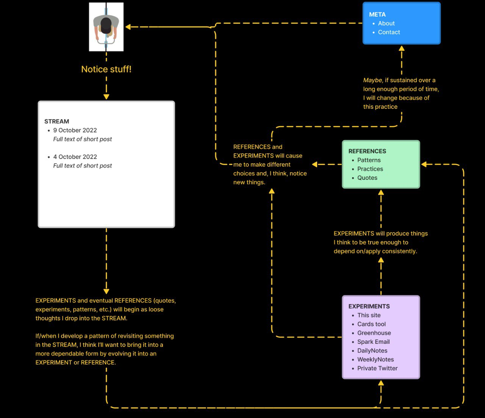

# 🪐 welcome


This space is, and will always be, a permanent work in progress.


hi and welcome! I’m Peter.&#x20;

Ping Practice is a place for me to experiment with strategies for building the self-knowledge I need to translate everyday experiences into insights and actions that align with what I need and value.

Read more [about me](about.md), [get in touch](mailto:peter@pelberg.com), or read about [the experiment that started this](experiment-dailynotes.md).

## Stream

_Observations and loose thoughts._

5 February 2023

### Making Space, Collaboratively

Some loose/quick/initial thoughts on space...

* I resonate with spaces where I, and the people who are present with me in it, feel safe and empowered to improvise&#x20;
  * Where "improvise" in this context means the ability to notice new information, without judgement, and make choices that they think cohere with what the people who share in the space are present to create.&#x20;
* I feel empowered to participate in a space when ([source](https://twitter.com/pingpractice/status/1577778444296929280?s=20\&t=66lYHsjFlZDKZxR8LT\_f\_g)):
  * There is a clear and shared objective for what we are trying to make (defined in the broadest of terms)
  * I trust that others will check whether they’ve understood what I’ve said in the way I intended it
  * I trust that I will have an opportunity to repair harm if/when I cause it
  * I trust that I will be seen for what I know and have experienced
  * I trust I will be listened to
  * I trust that others will assume I am acting in good faith
  * I know that we have practices/traditions in places to remember the choices we make and why
* I enjoy playing the role of someone who:
  * Creating the conditions necessary for the group to decide what they will commit to making and why&#x20;
  * Supplies the group with the clarity they need to deploy the expertise they've developed.&#x20;
    * Where "deploy" could mean things like: assessing risk, creating an artifact, determining whether a piece of new information is notable enough to be shared with the rest of the group

3 February 2023

### Prompts&#x20;

I value it when a space, person, etc. invites me to say aloud something for the first time.

This happened during [today's are.na walkthrough](https://www.are.na/are-na-team/02-03-23-channel-walkthroughs-ft-luiza-dale-peter-pelberg-noa-mori-njari-anderson): _I appreciate prompts that are proximate and clear enough that I can immediately pick them up/reach for them and in doing so, be moved to see something that feels new, fresh...something I might not have seen otherwise._

8 January 2023

### Reminders&#x20;

When I start the process of thinking about something I need to do (e.g. a conversation I need to lead, a decision I need to make, a set of slides I need to produce, etc.) that is not yet clearly "scoped" in my mind, I'll usually create a new section in my "scratch" file.

I'll title that section the name of the thing I'm needing to do and within it, add a few, standard sub-sections. \[i]

Lately, when thinking about doing something that I'm less practiced with, I've started adding a new section titled, "Reminders."

Within this section, I'll place things, that well, I find myself needing to be reminded of in order to "embody" the space the thinking I need to do exists within.

For example, in the moments before writing this, I was sketching out what it might look like to send an email at some  cadence that serves as _invitation_ for people _into_ the work I'm doing to refine and actualize [the app](app.md).&#x20;

Doing the above feels new for me and I found the reminders (see screenshot below) effective for inspiring me to "keep going" in moments when uncertainty tempts me to stop.

.png>)

\---

i. The "standard sub-sections" I add are:

* Objective
  * _"What impact is/are the actions I am trying to define an effort to accomplish? For who?"_
* Decision(s) to be made
  * If the outcome of this thinking is me making a decision: "_How can I articulate the decision(s) in a way that makes it clear what this decision will, and crucially, will NOT impact?"_
* Open Questions
  * _"What questions are emerge as I inhabit the space of this challenge/objective/etc.?_

3 January 2023

### Journaling and Self-Knowledge

The path here started with journaling. Overwhelmed with thought, I turned to writing to "move through" what I was feeling. With time, journaling equipped me with new capacity and tools to "hold" more and "let go" more easily. It also summed into a body of self-knowledge I've drawn on to make choices of all kinds that continue to shape the experiences and impact I \[attempt to] have here.

It feels good to say these words – "journaling" and "self-knowledge" – aloud again; they feel true, solid, capable of being build upon.&#x20;

I've felt far away from this language and I'm grateful for Ashley, Kyle, and Obi for bringing me back to it. I feel at home in them and I'm eager to invite more people in using them.

27 November 2022

### Questions

I like how conceiving of questions/prompts as doorways draws my attention to the responsibility that questions/prompts have for earning the trust of the person receiving them and evaluating the extent to which they'll engage with them.

This leads me to a question that's something like: _"What could cause people to feel more trusting of, and willing to engage with, a question that doesn't immediately resonate with them?"_&#x20;

That phrasing doesn't quite capture it, but it's a start.

19 November 2022

### Micro-syntax

I'm attracted to describing the personal classifiers I talked about on [3 November 2022](./#3-november-2022-1) and [31 October 2022 ](./#undefined)as a kind of "micro-syntax" or way of declaring or codifying types of thought in an explicit enough way that I "operate" on them at some later point.

### Quotations

Speaking of micro-syntax, I've developed a habit of using quotation marks (`" "` ) as a way of communicating to myself, and ideally other people, that a particular word or metaphor I'm using is a sketch, not yet something I have conviction in.

I find that doing the above helps break me out of the _"find the ideal"_ language loop I can find myself getting stuck in when trying to externalize a nascent thought.

3 November 2022

### \[Reflex]

Building on the idea of [thought types from 31 October 2022](./#undefined), I wonder if there could be meaning in experimenting with using a`[reflex`] thought type.&#x20;

Where "reflex" could be a moment when I feel, say, unseen, hurt, sad, etc.

The idea here being these reflexes are likely related by a perceived unmet need, value, etc.

_Aside: I feel inclined to create a page titled something like "Thoughts." I'm imagining I'd use this page initially for: A) defining "thought types" and B) defining what I mean when I say "thought" considering how central that concept is to this practice._

31 October 2022

### Thought types

I have gotten into a habit of prefixing some things I say to myself (and other people in certain contexts) with a term bounded by square brackets. So, things like:`[question]`, `[prompt]`, `[idea]`, `[ask]` etc.

And I'd like to draw a quick sketch for why I think this might be the case:

1. **Stability/Durability.** Questions, prompts, ideas, etc. are relatively stable and distinct concepts/categories of thoughts in my mind. Experience has demonstrated to me that my current and future selves are likely to have a shared understanding for what does and does not qualify as a question, prompt, idea, etc. \
   \
   In this way, using a tag as stable as \[`question]` makes it possible for me to easily assemble a set of related thoughts across time. This helps make answering big, and generative, questions like _"What have I been wondering about over the past few weeks?"_ or _"What might I write about it? Why don't I see what `[writing ideas]` I've thought about in the past couple of weeks"_ pretty easy to ask and answer.
2. **Applicability.** Questions, prompts, and ideas, have clear use cases in my life. In this way, being able to more easily locate them across the various tools where I accrue them creates a great deal of possibility for me.
3. **Legibility.**  Just like the presence of a question mark (`?`) makes it clear to people what a thought is seeking, prefixing a thought with bracketed thought type - I think – makes it easier for people to understand what it is a particular thought is trying to say to them.

For context, I felt compelled to write all of this after noticing myself using the `[prompt]` construct in a new context: within a "Book Note" for _Thought As A System_. \
\
I think I considered this notable because seeing myself using this pattern in a new context without thinking about led me to think something like, "Huh, this pattern seems become useful enough to be something I'm "bringing with me" wherever I "go."

_Aside: I'm reluctant to categorize the above as "tags" per se, but I think that's just because I have negative associations with a particular implementation of tags which I appreciate to be a far more open-ended concept. Maybe it would be worthwhile to talk about tags some more  and why I think the implementations I've seen have done little to guide me to use them in ways that make it easier for my future selves to find what they are looking for later. Think: topical and the moments tools often present people with the opportunities to apply them._

28 October 2022

### Directing pings

I think it would be neat if the tool could support me sending pings (_see below)_ to the tools I'd like to act on them within.&#x20;

The above leads me to wonder whether there's something to this idea of being able to create some kind of "meta" area around the workspaces I frequent.&#x20;

_Thinking: these activity spaces would become more generative and richer, and the ideas within them would become stronger, if I could more easily draw on relevant thoughts/ideas while I'm working within them. I also wonder whether having the ability to "send" pings to these spaces without having to visit them would help me advance ideas more quickly because I will have better recall of the range of tools available to me at any given time._

### Fun

Wow. This place feels great to be in...I'm having fun ^ \_ ^ Thank you for the metaphor, Laurel!

26 October 2022

### "Stream" Purpose

I think I'm going to constrain this stream to thoughts related to thoughts related to working with information.&#x20;

The above had been pretty much implicit in my mind, but sometimes I find it helpful to explicitly say or write out things out to reinforce them.

24 October 2022

### "Where should I put this?"

In the moment just before arriving here, I was feeling excited as I thought about all of the things I wanted to talked about from today.

Now, I'm here. I'm not writing in DailyNotes, I'm not writing in Twitter, I'm not in Messages, and I'm not drafting an email. I could see each of the topics I was wanting to write about being a fit for these different places, but I couldn't see a single place where they'd all fit.

That little question – _"Where should I put this?"_ – was enough to interrupt the flow I felt. I think that's all what I'm wanting to name for now: the blocking force of this choice and the ease with which it can resurface.

### Synthesizing&#x20;

I think writing out loose thoughts has helped me to become more effective at spontaneously synthesizing what I'm thinking in feeling in conversations, meetings, etc.

In this way, I think I'm starting to feel more confident in my ability to improvise.

10 October 2022

### Ping Practice Flow&#x20;

Sketches of what information I imagine Ping Practice to hold and how it will flow within the site.\
&#x20;

