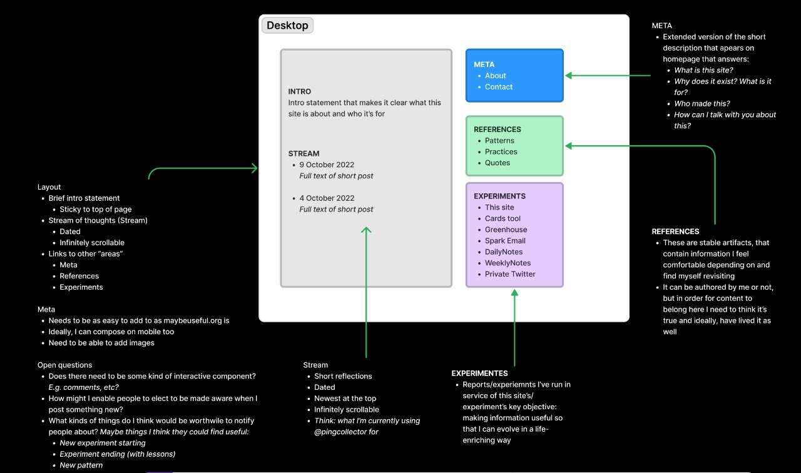

# 🪐 welcome


Ping Practice is and will always be a permanent work in progress.


hi and welcome! I’m Peter.&#x20;

Ping Practice is a place for me to experiment with ways to become more effective at developing insights that help me evolve in the roles I play and contexts I exist within.

Read more [about me](about.md), [get in touch](mailto:peter@pelberg.com), or read about [the experiment that started this](experiment-dailynotes.md).

## Stream

_Observations and loose thoughts._

28 October 2022

### Directing pings

I think it would be neat if the tool could support me sending pings (_see below)_ to the tools I'd like to act on them within.&#x20;

The above leads me to wonder whether there's something to this idea of being able to create some kind of "meta" area around the workspaces I frequent. _Thinking: these workspaces would become more generative and richer and the ideas within them would become stronger because of my increased ability to remember them and thus an increase in the frequency with which I am "interacting" with them._

### Fun

Wow. This place feels great to be in...I'm having fun ^ \_ ^ Thank you for the metaphor, Laurel!

26 October 2022

### "Stream" Purpose

I think I'm going to constrain this stream to thoughts related to thoughts related to working with information.&#x20;

The above had been pretty much implicit in my mind, but sometimes I find it helpful to explicitly say or write out things out to reinforce them.

24 October 2022

### "Where should I put this?"

In the moment just before arriving here, I was feeling excited as I thought about all of the things I wanted to talked about from today.

Now, I'm here. I'm not writing in DailyNotes, I'm not writing in Twitter, I'm not in Messages, and I'm not drafting an email. I could see each of the topics I was wanting to write about being a fit for these different places, but I couldn't see a single place where they'd all fit.

That little question – _"Where should I put this?"_ – was enough to interrupt the flow I felt. I think that's all what I'm wanting to name for now: the blocking force of this choice and the ease with which it can resurface.

### Synthesizing&#x20;

I think writing out loose thoughts has helped me to become more effective at spontaneously synthesizing what I'm thinking in feeling in conversations, meetings, etc.

In this way, I think I'm starting to feel more confident in my ability to improvise.

10 October 2022

### Ping Practice Flow&#x20;

Sketches of what information I imagine Ping Practice to hold and how it will flow within the site.\
&#x20;

