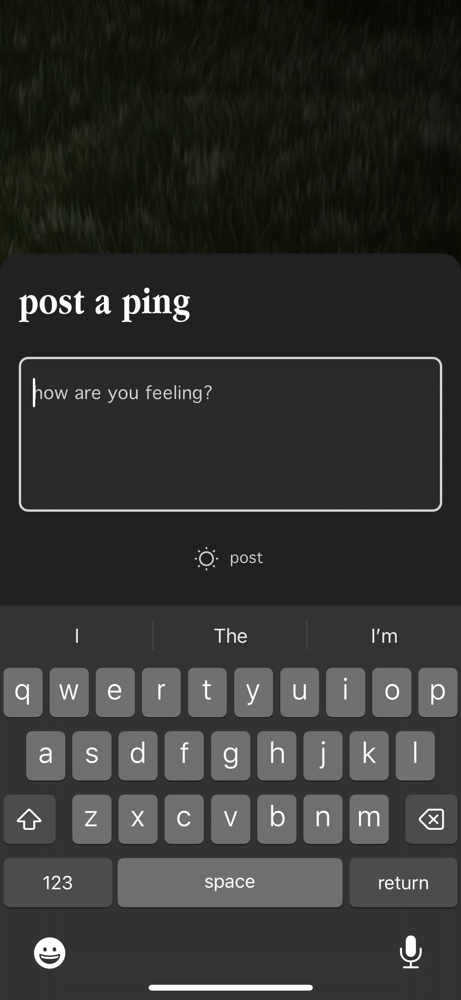

# Ping Practice (1.0)


Development began September 2023.


<figure><figcaption>
Ping Capture 
</figcaption></figure>

 

<figure><figcaption>
List of Pings
</figcaption></figure>

## Research questions&#x20;

_#TODO_

## Details

_#TODO_

## Log

### 18 April 2024&#x20;

We seem to have [arrived into language](https://pingpractice.org/) that is somewhat effective at helping people recognize "Pings" amongst the range of thoughts/feelings they experience.

At the same time, a question [Alex](https://www.alexhollender.info/), [Carolyn](http://carolynlimadeo.com/), Ell, [Jeff](https://jnoh.net/),  and [Laurel](https://laurelschwulst.com/medium/writing/) identified remains answered: _What form does a Ping take on in the context, of say,_ [_the app_](../app.md) _we're building? \[i] Further, how might a Ping standout in relation to other digital formats/contexts? \[ii]_

I'd like to begin sketching out some ideas by exploring the following upstream question:

> _What might you need from Pings in order for them to be useful?_

* A Ping needs to be able to transport you back to the "place" /moment it emerged within so that you can explore and uncover the meaning it might hold for you
* There need to be many different ways you can arrive back to Pings so that you can:
  * Increase the likelihood you might serendipitously/unintentionally happen upon a Ping that's meaningful to you&#x20;
  * Triangulate your way back to Pings you don't remember the precise location of
* A Ping needs to help you evaluate the extent to which you can depend/rely on it.&#x20;
  * _Said another way: you need to know how "safe" it is to run/embody/apply a Ping in practice._
* A Ping needs to remind you of you.
* You need to feel safe iterating upon a Ping as it's meaning evolves over time.
* A ping needs to be medium agnostic so that you feel empowered to capture a Ping in a way that feels most [convenient](voice-memos.md) and expressive of the moment you're capturing it within.

Holding all of the above in mind, some ideas come to mind for what properties may end up comprising the Ping format we can not yet clearly see:

* Capture date
* Capture time
* Capture location
* Unique ID
* Visit count
* Visit log (day, time, etc.)
* Number of replies (if any)
* Medium&#x20;
* Resonance count
* Time elapsed since capture
* Relationship to notable events/moments
* Edit history
* Time elapsed since last visit
* Size
* Places that reference this Ping
  * _Ideally, "places" could include artifacts internal and external to Ping Practice app._
* Time spent composing initial Ping
* Cumulative time spent visiting Ping
* Time of last edit
* Total number of edits (human / bot)
* Average time between visits
* Average visits per day/week/month
* [Assessment](https://en.wikipedia.org/wiki/Wikipedia:Content\_assessment)&#x20;

***

i. In this moment, I'm intentionally scoping this question to the app and excluding other contexts in which people might be capturing what – in this universe – are calling "Pings."

ii. E.g. Instagram, Twitter, camera roll, TikTok, etc.

### 8 February 2024

_Pace layers_

<figure><figcaption>
 Ping layer of abstraction (v0.1)
</figcaption></figure>

[Carolyn](http://carolynlimadeo.com/) helpfully posed a question some weeks ago that I remember as something like, _"What might it look like to look at Pings at various zoom levels?"_

The notion of "zooming" immediately resonated, both in terms of the interface/navigation and this question of, _"How does Ping Practice inspire you to reliably translate these discrete 'captures' into wisdom?"_ \
\
This second bit led me to wonder, _"Might zoom in the Ping Practice Universe refer to compression?"_ "Compression" in the sense that Ping Practice is driving you to create tiny artifacts, broadly defined, that are [capable of describing a whole body of Pings/observations](#user-content-fn-1)[^1]. In this way, they can quickly help you identify the context you are present within, arrive into it, and [organize yourself into an entire way of being](#user-content-fn-2)[^2].

The diagram above is a first pass at bringing some visual shape to the above. Next time, I'd like to walk through some actual examples to evaluate the extent to which this way of thinking reflects/describes what I've experinece with Ping Practice.

### 19 January 2024

_Artifacts_

.jpg>).PNG>)

I'm feeling inspired by the prospect of a potential artifact that can serve as a dynamic/ever-[evolving personal frame of reference](#user-content-fn-3)[^3], the primitives for which could be Moments/Events, Phases/Periods, and Cycles/Loops. _More on those another time._&#x20;

In this moment, I could see this "frame of reference" containing the following:

* _Fatherhood: an incrementing counter of the number of days it's been since Leila was born_
* _Parent's visit: a decrementing counter of the number of days left until my parent depart for home._
* _Leila's age: some kind of bounded block of time that gives some rough shape to what Leila is likely experiencing. E.g. development leaps she's going through, what she's likely to be needing in any given moment._

### 14 January 2024

_Artifacts_

In thinking about the artifact(s) Ping Practice could inspire and empower you to make, new language surfaced for what I notice myself needing. I sense the questions that follow could eventually inform the "shape" of these yet-to-be-named artifacts...

1. _Might I be more present and accepting of how I’m feeling if I can easily reference the "features" of the present moment  (e.g. responsibilities, interactions, choices, etc.)  that have been impacting me?_
2. _Might I be able to more effectively embody an intention if it’s bounded/related to a phase/period of time that I've named?_

### 5 January 2024

_Memorable Artifacts_

<figure><figcaption>
Iteration of Ping Practice method diagram by Laurel Schwulst.
</figcaption></figure>

Ping Practice is meant to help you become clear about what's meaningful to you and make that meaning memorable enough to embody.

Although, as [Alex](https://www.alexhollender.info/), [Jeff](https://jnoh.net/), and [Laurel](https://laurelschwulst.com/) have identified, it's not yet clear to what extent – if any – Ping Practice (the app/tool) offers the affordances people need to be inspired and equipped to compile/create/converge on these meaningful artifacts.

I think it's important to arrive at a clear opinion on the above – regardless of what that opinion is – because I think these artifacts are fundamental to addressing the [core needs](https://ping-practice.gitbook.io/pings/needs) Ping Practice is an effort to meet.&#x20;

This topic feels quite big to me. To start, I'm thinking I'll review the meaningful and memorable Pings I've created over time.

### 31 December 2023

_Notable Pings_

<figure><figcaption>
Notable Ping (30 Dec 2023)
</figcaption></figure>

Every so often, [a Ping will emerge that feels distinct from other Pings](#user-content-fn-4)[^4]. I know I'm encountering a Ping of this sort when its emergence causes a flood of other Pings to surface or collect within it. Sometimes, these Pings have the effect of making movement clear in a context that I'd previously felt stuck within.&#x20;

_In my mind is the image of a natural dam giving way and with it, water flowing freely through – what had previously been – a constricted waterway._

Last night, a Ping of this sort surfaced, _"I'm creating from a place. I'm not creating to get to a place."_ This Ping, combined with a series of Pings before it, [summed into me becoming unblocke](#user-content-fn-5)[^5]d and clear and how I might go about nurturing [a creative practice that harmonizes with being present as a new father](https://www.youtube.com/watch?v=JRIosU6X060\&list=PLKUjvP9gOhhhrrTXtjXLMpfmrQ5\_6SshL).

Beyond these Pings' power to unblock and generate new thoughts, they tend to be durable, relevant to the broader context/place[^6] I find myself within. In hindsight, these Pings also tend to be memorable. They can quickly bring me back into the moment they served me within...they can demarcate time.

The power and durability of these Pings leads me to wonder:

1. _How – if at all – might the interface inspire you to converge on "notable" Pings?_
2. _Where – if at all – might the interface afford space for "notable" Pings to gather?_

### 27 December 2023

_Revisiting_&#x20;

* Revisting: consistently experiencing instinct to "go back"; current ability to explore feels limited&#x20;
* Artifacts: neding affordance(s) to inspire me to create intentions&#x20;
* _Look back through "meta" pings_

###

[^1]: Drawing inspiration from Jürgen Schmidhuber writing in [Driven by Compression Progress](https://www.are.na/block/12518234).

[^2]: "The power of meaning is that it completely organizes being." | [David Bohm](https://www.are.na/block/22989196)

[^3]: I think [character creation experiences](https://en.wikipedia.org/wiki/Character\_creation) in role-playing video games could be inspiring/instructive here.

[^4]: E.g. ["Pick up the phone"](https://www.youtube.com/watch?v=avOU29QkuPk\&t=33s)

[^5]: [Creating from a place (YouTube)](https://www.youtube.com/watch?v=FlRLZzxCKZw)

[^6]: Where "context/place" here refers to something that spans time on the order of weeks.
