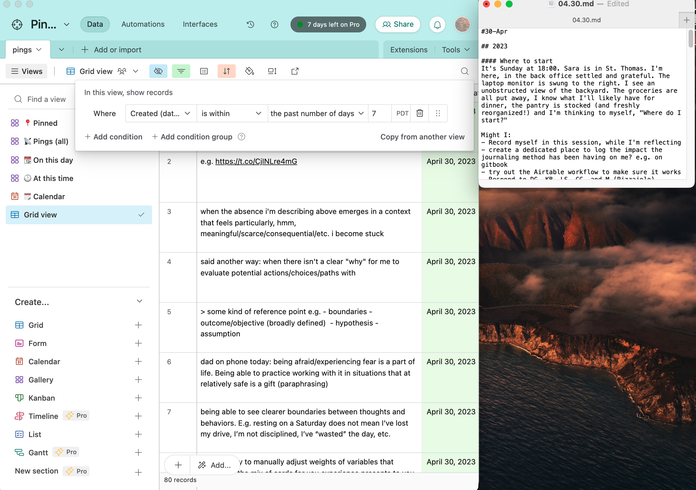

# Twitter Pt. 2


This experiment started on 10 April 2023.


The [Twitter experiment](twitter-pt.-1.md) proved successful in so far as the behavior it was intended to help me evaluate – [noticing and naming Pings](../method.md) – [stuck](twitter-pt.-1.md#impact-and-conclusions). At the time of writing (23 April 2023), I've jotted down 2,300+ Pings and I continue doing so most days.

[Motived to experiment](twitter-pt.-1.md#impact-and-conclusions) with ways to simulate the serendipitous revisiting and discovery [the app describes](../app.md) and prompted by a conversation with [Prateek](https://prtksxna.com/), this experiment is an effort to prototype a distinct place I can go to revisit and discover past Pings.\

## Research questions&#x20;

## Impact & Conclusions

## Motivation&#x20;

## Details

## Log[^1]

### 11 May

#### `🟢 Active` View and Jigs

Okay! Something is connecting and I'd like to try to map it out...

I notice [the current Airtable set up](twitter-pt.-2.md#details) enabling/prompting/affording me the ability to do [what I felt like I've needed all along](../need-memory.md#needs): "present peter" [remembering and crucially, acting on the clarity/truths/intentions/etc. "past peter" converged on](#user-content-fn-2)[^2] _within_ the fleeting moments where I/he[^3] has sensed opportunities to apply them.

Naming the above feels notable. Reason: in coming to realize this impact, I think I'm also starting to see the behaviors that may be contributing this slight behavior change emerging:

1. I'm revisiting `🟢 Active` often.&#x20;
2. In revisiting, I'm engaging with/"picking up"/thinking/considering what's there. Said another way, when I'm in `🟢 Active` , I'm active! I'm asking myself questions like, _"Is this card still relevant? How might I make this language more memorable? What picture/video might illustrate the essence of this card?"_

Put simply, I think "1." and "2." are causing these cards, and the messages they represent, to remain present in my mind when I'm out in the world, away from this interface.

### 7 May

#### IDs + Record linking

<figure><figcaption>
Searching for a record to link to the current one.
</figcaption></figure>

 

<figure><figcaption>
Showing the new ID field visible on the card.
</figcaption></figure>

Ok! Two adjustments tonight that I feel energized about...

1. I added an `ID` field to the Airtable base and exposed it on cards in the `🟢 Active` view. This field will get automatically populated each time a new record is added.
2. I added a field that will enable me to link records together.

When I combine the following three things:

1. The two adjustments above&#x20;
2. The language shift from `📍Pinned` to `🟢 Active`,&#x20;
3. The assumptions that I'll continue regularly revisiting the "`🟢 Active"`view

... I can start to see a future where:

1. I'm able to recall the `IDs` of cards that are important/meaningful to me at any given time **from memory**.\

2. I'm revisiting, referencing, refining, and expanding these cards more often and by extension, they're becoming more meaningful.\

_Note: the two scearios I'm describing above already happens to me at work with_ [_Phabricator_](https://phabricator.wikimedia.org/) \
\
_It usually goes like this..._\
\
_We'll start work on a range of tickets. There will be some subset of these tickets that I/we reference more often than others. As this happens, I start to memorize the numbers of these tickets. And then, because I've memorized these ticket numbers, I end up referencing these tickets in conversation and in my own thinking/writing more often._ \
\
_In doing so, I end up revisiting these tickets to contribute new information (no matter how small) and refine what's already there. I also link to these tickets in the new tickets I create and comments I write elsewhere._&#x20;

[_All of this sums into discrete artifacts that reflect and "hold" what I/the team actually thinks and are linked together creating a legible record of what we did and did not decide/make over time the impact of which is, I think a team that can learn and evolve together and therefore feel more fluid making decisions, experimenting and trying things out._](#user-content-fn-4)[^4]

### 5 May

#### Marking a thread as active


Showing workflow for marking a thread as "🟢 Active" in Airtable.


I find myself needing some extra support as I move into creating public doorways into this project (I'm thinking about a conversational video format to start. E.g. TikTok or Instagram Reels).

To provide that support, I'm going to experiment with doing the following:

1. Creating a thread to "host" / "hold" the conversation about this voice I find myself wanting to use
2. Marking this thread as 🟢`Active` so that it's easy for me to revisit.
3. Associating a picture with this thread so that it's more memorable and easier for me to arrive into the mindset it's asking me to.
4. Using Airtable's native Commenting feature to hold any thoughts that may emerge in the future. _Note: this one feels notable in so far as it's the first time I'm branching out from Twitter as the sold mode of composing._

### 3 May

#### Prompting / Scripting

<figure><figcaption>
Left: All pings from the past 7 days (Airtable). Right: 04.30.md note within <a href="dailynotes.md">DailyNotes</a>.
</figcaption></figure>

I jotted down – what felt like – a bunch of thoughts in my Drop Journal this past week. On Sunday (30 April), I sat down at my computer to try to make some sense of them ahead of the week I'm currently in.

To ready myself for this sensemaking, I created a view of what I'd dropped in my journal over the past seven days and brought up the `04.30.md` note within my [DailyNotes](dailynotes.md) alongside it. Raw material and a surface to sort through it.

In doing the above, I was wanting to revisit the specific things I'd been thinking about. More specifically, I was wanting to arrive back in the headspace those thoughts emerged within. Seeing everything together in a moment where I felt like I had the space and energy to think was wonderful.

Reflecting on the above brought me back to what Obi shared during the [first set of conversations](../conversations/phase-2.md). Obi shared that when he arrives in the studio for a recording session, he'll often pull up his Apple Notes to review what he's been thinking about to see if anything there inspires/moves him to make music to.

The connection I'm drawing here between the experience I had on Sunday and the experience Obi shared with me some months ago feels fresh and notable to me. I think it's because I'm starting to see a more visceral connections between these contexts/applications: improvisation and bringing together/readying the "raw material" to do so.

#### Improv

The reflection/observation above is leading me to see a potential way through the blockage I've felt posting more publicly...

What if I act like Obi does:&#x20;

1. Book "studio sessions" for myself. As in: I'll commit to making something to share at a specific time and place for some bounded period of time.
2. In the time between each "improve sessions" I'll log all the ideas that surface to me in a consistent place.
3. When I arrive at the "studio" I'll "swipe through" the ideas that I've accrued through "2." and act on one that speaks to me.

### 27 April&#x20;

#### Pinned

<figure><figcaption>
Using the new "📍Pinned" view for the first time.
</figcaption></figure>

I'm starting to use the "Pin" field I set up yesterday which in turn inspired me to add an image today. Cool!

_Aside: I wonder if it might be interesting to call – what I'd previosuly been referring to as "Favorites" – simply "Active"...at least by default. Keep it simple, generic, and uncomplicated by people bringing existing meaning and expectation(s) to the word._

### 26 April

<figure><figcaption></figcaption></figure>

Added a "Pin" field that I'm thinking I can use to mark and quickly return to thoughts I want to more easily revisit.

### 24 April

#### Dashboard

<figure><figcaption>
Dashboard showing @pingpractice account activity over time
</figcaption></figure>

Woah!&#x20;

Now that I've got this dashboard set up, I'm immediately curious to see how - if at all – this view provides me a lens through which to look at, and engage with, this Ping Practice.

#### Adding meaning to "Favoriting"

<figure><figcaption>
Airtable's "Dashboard" interface builder.
</figcaption></figure>

Discovering that Airtable makes it possible to associate an image with a record (or in this context, a Ping), is helping me to imagine a new potential choice to consider when revisiting: looking out for Pings that feel especially resonant so that I can consider elevating them in some way (e.g. associating an image, or other types of media) to deepen/enhance/extend the meaning/message of the Ping and my ability to remember that meaning/message.

_Note: the above was prompted by me experimenting with setting up a "Dashboard" for the base I set up in Airtable. In doing so, I thought "Oh, it might be interesting to visualize how many Pings I've 'Favorited'."_

_See:_ [_https://twitter.com/pingpractice/status/1650580408151740417_](https://twitter.com/pingpractice/status/1650580408151740417)

### 12 April

#### Search

<figure><figcaption></figcaption></figure>

Just now, I was [saying something in @pingpractice](https://twitter.com/pingpractice/status/1646205350817955843?s=20). In the process, I noticed myself making a choice _not_ to use a possessive pronoun.  In making this choice, I thought to myself, "Oh this would be a good convention/pattern to name in the ["Personal syntax" are.na channel](https://www.are.na/peter-pelberg/personal-syntax) I started."

Next, I opened up are.na and I started [drafting this block](https://www.are.na/block/21361463) to describe/bring shape to this convention. A few moments in, I noticed myself getting stuck, not locating the words I felt like I needed to express the idea that prompted me to visit are.na in the first place.

_"Hmm, what to do now?"_ I thought and then realized, _"Oh, I've "pinged" (trying out this language) about this before."_

I then went to Notion to search for `pronoun` which quickly returned what I've said in the past about possessive pronouns and ultimately helped me arrive at the language I needed!

Before Monday, I would've gone directly to Twitter to attempt the search above which  past experiences have led me to doubt whether that search would return the Tweets I'm fairly certain existed.

### 11 April

#### Day/time lens/filter

.png>).png>)

I finished [this past Monday (10 April) feeling](https://twitter.com/pingpractice/status/1645606642724261888?s=20) similar to how I remember myself [feeling the Monday before (3 April)](https://twitter.com/pingpractice/status/1643057038199787520).

This led me to experience, and subsequently [develop a bit more conviction around](https://twitter.com/pingpractice/status/1645606642724261888), the utility of  [the app](../app.md) offering people an easy way to see what they've said on days/time that are similar to the moments they currently find themselves to be in and/or curious about.

In response, I created a new view within Notion that enables me to easily [see what I've said "on this day" across time](#user-content-fn-5)[^5].

[^1]: Observations and updates

[^2]: "Allow blockers to reveal themselves through action." is the card I'm referring to here.

[^3]: this third person stuff gets complicated quickly!

[^4]: this feels important.

[^5]: Ideally, the app will automatically know what day it is and surface relevant thoughts accordingly. Although, with this current set up in Notion, I'm still needing to manually input what day(s) of the week I'd like to see thoughts from.
