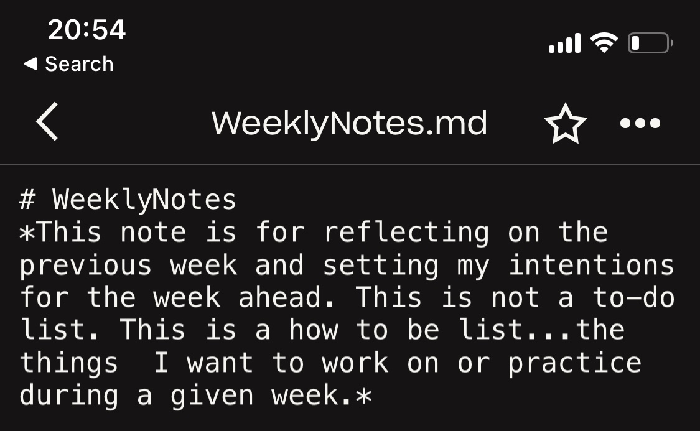

# WeeklyNotes


This experiment is complete. It clarified for me the power in compressing intentions into succinct and inspiring phrases.


### Description

The [DailyNotes Experiment](dailynotes.md) helped me to become clear about [needing a way to remember](../needs.md) how I wanted to be and what I wanted to be working towards.

To hold myself accountable to articulating a set of intentions and to make it easier for me to remember them, I created a new page called WeeklyNotes. This was the single place where I would write and iterate on the intentions I was trying to keep top of mind for me during a given week.

To start, the note lived within Dropbox in a file called `WeeklyNotes.md.`&#x20;

<figure><figcaption>
WeeklyNotes.md Dropbox file
</figcaption></figure>

### Impact & Conclusions

The WeeklyNotes experiment helped me to see the power in compressing how I wanted to be and what I wanted to be working towards into a few succinct and inspiring set of phrases.

Doing the above helped me to actually remember what I was wanting to work on and towards. It felt like these guides were within reach in the moments where I had opportunities to apply them. In a way, I felt like these guides were opening up a new set of choices for me to consider in situations where I had become used to thinking and acting in a particular set of ways.

I'm not sure I would have arrived at this new format had I not noticed 12 weeks into the experiment that I wasn't revisiting the WeeklyNotes throughout the week.&#x20;

<figure><figcaption>
~12 weeks into the experiment; thinking about ways to make the WeeklyNotes practice more impactful.
</figcaption></figure>

I would come back to WeeklyNotes on Sunday when it was time to reflect, but seldom beyond that. The lack of revisitation combined with the prose-like reflections led the intentions I'd set for myself to quickly fade from my mind once the week got going.

So yes, writing short, memorable intentions did help me to improve my recall of them throughout the week, and more importantly, in moments where they could be useful. Although, I still felt there was room for me to become better at living into these intentions. This was the area I needed help with.

I should note, that late into the WeeklyNotes experiment I started pairing the intentions I was setting with quotes and they did seem to be somewhat helpful. Tho, I finished this experiment wanting to explore the power of quotes more deeply.

### Details

To hold myself accountable to articulating a set of intentions and to make it easier for me to remember them, I created a page called `WeeklyNotes.md.`&#x20;

This was the single place where I would write and iterate on the intentions I was trying to keep top of mind during a given week.

This practice started as a single file in Dropbox. At the top of this text file was its purpose:

<figure><figcaption>
Purpose of the WeeklyNotes page
</figcaption></figure>

And then within the WeeklyNotes page were headings for each week, with the most recent week at the top:

<figure><figcaption>
An example of what a section looks like.
</figcaption></figure>

For the first 8 weeks or so of the experiment, I was relatively loose with what I considered an "intention." Many of these early weeks ended up being more reflections than concise intentions per se. Regardless of the form, I was articulating the themes I thought were important for me to focus on in the given week.&#x20;

The process for writing these intentions typically went as follows...

On Sunday, I would revisit the WeeklyNotes note and reflect on how I thought the past week had gone, often revisiting the DailyNotes I'd written as prompts to get me thinking.&#x20;

I would then write a few sentences about how I wanted to show up in the week ahead and that was it.

In April 2020, 12 weeks into the experiment, I shifted the format of the WeeklyNotes page (now "Weekly Notes" as I'd started experimenting with Roam Research by this point). Rather than creating new sections for each week, I simplified things. There were now two headings that would remain constant:

* `Generative rules: constraints to guide growth`&#x20;
* `Objectives: what am I trying to accomplish?`

Each Sunday, I was still reflecting on the week that had just passed and thinking about the intentions I wanted to carry with me for the week ahead. Although,  now I started writing more concise and actionable intentions and objectives and accompanying the former with quotes that inspired me to "move" in these new ways:

<figure><figcaption>
Weekly Notes in Roam Research
</figcaption></figure>

