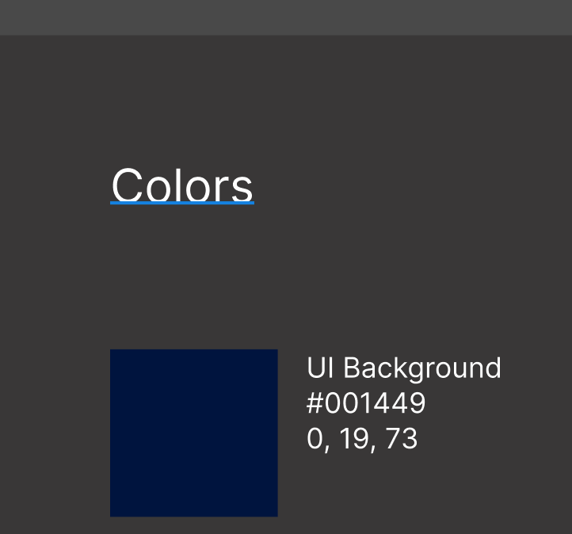

# Explorations

## Explorations

I feel energized by the prospect of there being a page on pingpractice.org that holds explorations: past, present, and not yet explored. Something like, pingpractice.org/explorations.

Specifically, I feel energized by:

1. The idea of this page being a meeting place: a place to discover other people who feel similarly attracted to exploring an idea.
2. The page offering a template or format that helps you scaffold the idea you are attempting to bring into "explorable form"
3. The idea of this page offering a body to reflect on, see connections between, etc.

## &#x20;

<figure><figcaption></figcaption></figure>

<figure><figcaption></figcaption></figure>

Prior to writing the above, this page/place had existed in my mind as "Quests." Although, Rachel and I have been using the term "Explorations" for the past couple of months so it felt more natural to use that term here.&#x20;

Let's see.

## Format

#### Prompt

_This section will contain an invitation that frames the exploration: What is it about? What is the exploration seeking to explore?_

_Note: this 'prompt' ought to be concise to the extent that someone can, with a quick skim, get a senes for what this exploration is about to the extent that they can decide whether it resonates or not._

#### Background/Origin

_This section will contain the observation(s)/pattern(s) the exploration is grounded in/a response to, substantiated by evidence. E.g. pings, qutoes from conversations, etc._

#### References&#x20;

_This section will contain_ &#x72;_&#x65;ferences of "things" (broadly defined) that fit within the space/world this exploration is an invitation into. Maybe links to are.na blocks? This section could also include sketches of the idea (or facets of it) too._

#### TBD

* Use case(s)
* Potential impat(s)

## Index

<table><thead><tr><th width="211">Exploration</th><th width="154.33333333333331">Date</th><th>Description</th><th>Status<select><option value="NC7WhCOWJMUl" label="Implemented" color="blue"></option><option value="vNGFa2WcpG07" label="Integrated" color="blue"></option></select></th></tr></thead><tbody><tr><td><a href="../prototype-ping-randomizer.md">Ping Randomizer</a></td><td><strong>2023</strong> Summer</td><td>Tap a button, see a random Ping</td><td>Integrated</td></tr><tr><td><a href="thermal-printer.md">Thermal Printer</a></td><td><strong>2025</strong> Summer</td><td>Print Pings using a thermal printer.</td><td></td></tr><tr><td>Export Ping</td><td><strong>2025</strong> Summer</td><td>Export a Ping for use in other contexts/tools.</td><td>Integrated</td></tr><tr><td><a href="long-press.md">Long press</a></td><td><strong>2025</strong>  Summer</td><td>Long press on any ping to reveal a set of actions</td><td>Integrated</td></tr><tr><td><a href="custom-lenses.md">Custom lenses</a></td><td><strong>2025</strong> Summer</td><td>Create a custom "lens" made up of related Pings</td><td>Integrated</td></tr><tr><td><a href="place-in-capture.md">Place in Capture</a></td><td><strong>2025</strong> Summer</td><td>Replace the defualt "Listening for pings..." helper text with a ping of your choosing.</td><td>Integrated</td></tr><tr><td>

<strong>"Practice" view</strong>: 
</td><td></td><td>

A view further "zoomed out" from "grid" that would enable you to, at a glance:
<ul><li><em>See when you have and have not pinged</em> </li><li><em>Navigate back to specific days</em></li><li><em>Develop a general sense for your high-level practice. Think: weather.</em></li></ul></td><td></td></tr><tr><td>

<strong>Imbue a Ping with Color (Chris R.)</strong>

</td><td></td><td></td><td></td></tr><tr><td>

<strong>Public Pings</strong>
</td><td></td><td></td><td></td></tr><tr><td><strong>Ping notebook</strong></td><td></td><td></td><td></td></tr><tr><td><strong>Ping-style conversation</strong></td><td></td><td><em>Think Elliott at November Wordhack event.</em></td><td></td></tr></tbody></table>

