# Loose

## 1 August 2025

In talking with Justin today, something clicked...

To date, I've been focused&#x20;

## 28 July 2025

<figure>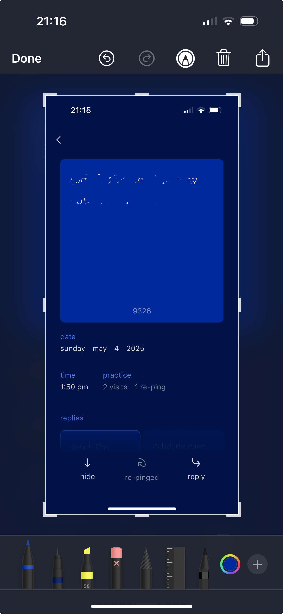<figcaption></figcaption></figure> <figure>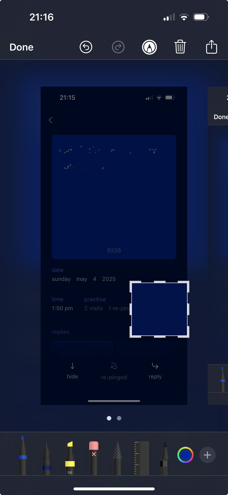<figcaption></figcaption></figure>

Sometime last week, I think, I changed the avatar I'd been using on Instagram for >5 years. \[i]

I set the avatar to a screenshot of a Ping that has been feeling important to me. On Instagram, this "glimpse' appears as a solid circle, color `#001449` . This is the same color as the default Ping Practice app theme.&#x20;

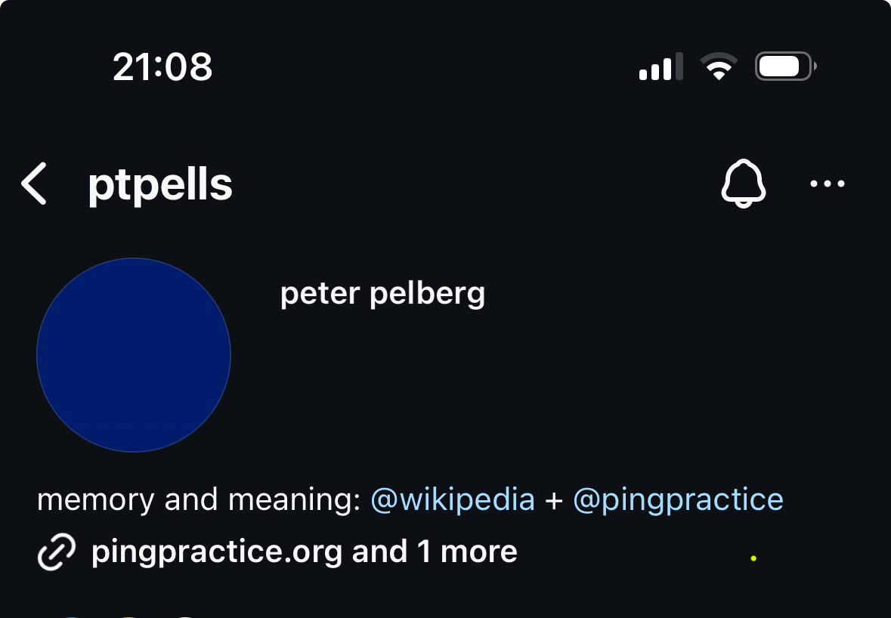

In the days since, I've set the avatar I use for Gmail (and maybe across all Google services?) and Slack at work.&#x20;

When I look at and think about this avatar, I feel grounded, spacious, clear, calm, rooted, and light. I think about the Ping that inspired all of this, the person whose words I felt moved to capture, and unexpectedly, "my" entire _body_ of Pings.&#x20;

_And then,_ when I think about the above in the context of one of the key questions that has inspired the [Thermal Printer](explorations/thermal-printer.md), Export Ping (TBD), and [Place in Capture](explorations/place-in-capture.md), an idea I feel a strong attraction to surfaces:

> _What might it mean/be like to "take a picture" of a Ping? To express it in some kind of abstract form that enables the Ping to stand on its own while at the same time retaining the feeling/sense/meaning/message/etc. that moved you to capture it in the first place?_

_Thank you to_ [_Laurel Schwulst_](https://laurelschwulst.com/) _who, in noticing (and drawing my attention back to the avatar) inspired me to reflect on all of this._

Notes

i. Meta: I wonder if Instagram offers the ability for me to see what avatars I've used over time. To me, features of this sort, are precisely the sort of curiosities, questions, and ultimately, reflection I desire interfaces to offer.

Anyway,&#x20;

## 8 July 2025

> Ping practice is the ‘lightest-touch’ way I have (on my phone, at least) of recording down my thoughts, which (at least for me) was my main hope for the app – to have a way of naming thoughts **without** suffocating them with **expectation** or any instrumental **goal**&#x20;

[Irena](https://www.irena-w.xyz/) shared the above during the [June 27 Ping Practitioner Call](https://docs.google.com/presentation/d/1V6312Z6-joLsF1aQMA5lLt1-FwkYE7RVz_OcZaLK6tE/edit?pli=1\&slide=id.g36afdb96052_1_73#slide=id.g36afdb96052_1_73). This notion Irena is raising about Ping Practices _not_ placing an expectation or goal onto the pings you capture is instrumental to the Method.

Further, I think this notion brings clarifying language to the resistance I've felt towards interventions that  attempt to "fix" pings.

## 2 May 2025

<figure>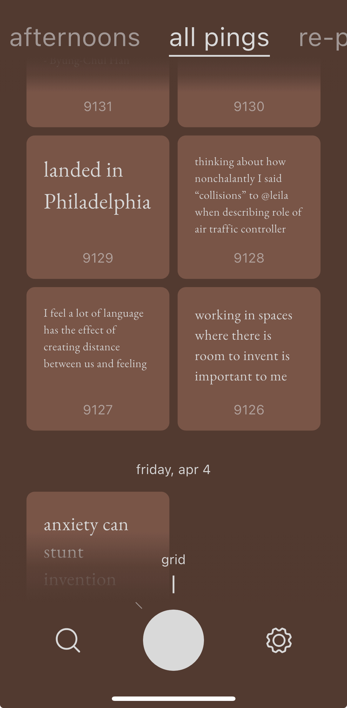<figcaption>
Ping Practice (Friday, May 2, 2025)
</figcaption></figure>

The rate at which "my" corpus of Pings is growing, to me, is evidence of how effective the current app experience (and mechanics) are at inspiring me to use it for capture.

_And_ scrolling through thousands of pings in "grid" view right now brings me back in contact with what people (e.g. Laurel, Bao, [Jamie](https://docs.google.com/presentation/d/1V6312Z6-joLsF1aQMA5lLt1-FwkYE7RVz_OcZaLK6tE/edit?disco=AAABf6eNX4I), [Kirsten](https://docs.google.com/presentation/d/1V6312Z6-joLsF1aQMA5lLt1-FwkYE7RVz_OcZaLK6tE/edit#slide=id.g34d439da168_1_52)) [have been expressing](https://docs.google.com/presentation/d/1V6312Z6-joLsF1aQMA5lLt1-FwkYE7RVz_OcZaLK6tE/edit#slide=id.g34d439da168_1_52) and I too continue to experience: a draw towards being able to do more with Pings within the app (more in [28 April 2025](https://ping-practice.gitbook.io/pings/loose#id-28-march-2025')):

* _To make meaningful pings more prominent_
* _To enrich pings to be more sensorial_
* _To store/express the relationships you notice between pings_
* _To explore a ping further (e.g. to "sharpen" it, to make it more specific)_
* _More broadly, to make, place, and clarify meaning!_

I think how I reencountered this gap/tension is relevant here for I think it might elucidate _a_ reason I've felt less urgency towards addressing it, so far...\
\
I was scrolling back through Pings today with the intention of looking for inspiration for a longer form piece of writing I was in the middle of. In this way, I already had an explicit place to store pings I wanted to relate and keep within reach, albeit external to the Ping Practice app.

And I think it's the existence of such a place and a practice that's enabling me to meet the need/desire I think we're all aligned in experiencing.

I also think Ping Practice does need to eventually offer support for – what amount to – the latter two steps of the [method](https://pingpractice.org/method/): **Create** and **Embody**.

Now, how we do that in a way that is intrinsic to Ping Practice, I think will require some exploration.

## 28 March 2025

Laurel has helpfully brought our attention back to the fact that, at present, the Ping Practice app is somewhat static.

"Static" in that you are limited in the ways that you can interact with pings. _E.g. to store/express a relationship you notice between pings, to enrich pings to make them more sensorial, to make meaningful pings easier to reach for and encounter, etc._

To help bridge this gap, an idea surfaced that's akin to offering people a relatively constrained way of labeling pings a la [starring in Gmail](https://support.google.com/mail/answer/5904?hl=en\&co=GENIE.Platform%3DDesktop).

I've sensed some resistance to this style of idea and I'd like to articulate why and begin to sketch an alternative approach that I feel more resonance with.

I think the resistance I feel to the labeling-style approach is the extent to which I perceive it:

1. _Requires you to invent its meaning before it become useful_
2. _Lacks an explicit way to encode and track the meaning you store within it_
3. _Being vulnerable to  meaning evolving over time_
4. _The collection of pings losing coherence as a result of "2." and "3."_

More broadly, I feel an approach of this sort prioritizes ordering and organizing above meaning-making and action.

For me, I've noticed experiences like this end up encouraging me to create structures that end up feeling stale and brittle and as a result, foreign to my future self.\
\
In retrospect, these organizing actions feel less like movement, if that makes sense. &#x20;

What feels more resonant to me is expressing meaning through more placed-based choices that intrinsically suggest an application/use. &#x20;

<figure>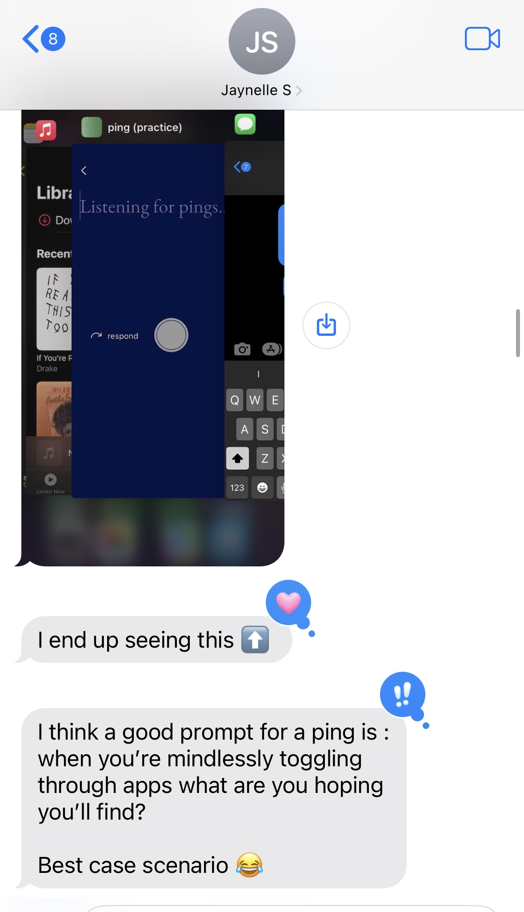<figcaption></figcaption></figure> <figure>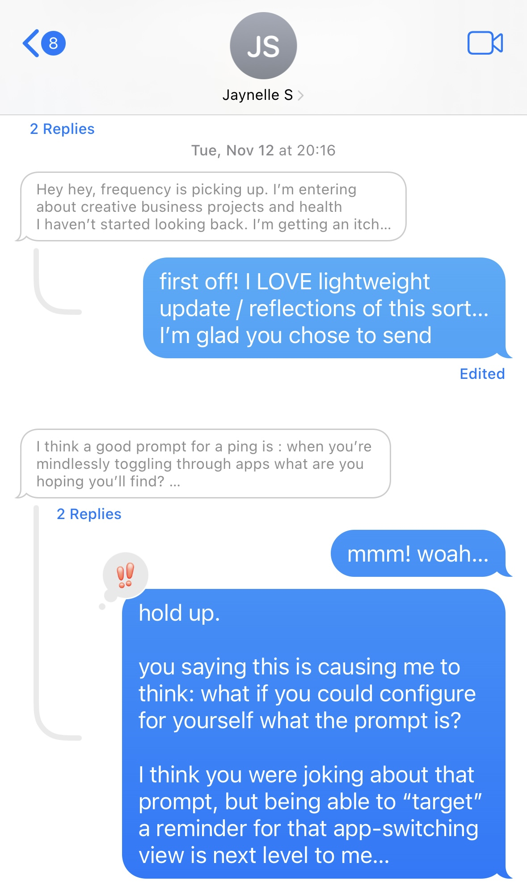<figcaption></figcaption></figure>

_E.g. I can imagine myself setting a ping I want to remember as the helper text that appears within the capture screen. I can image there being some kind of public-side to our respective practices that  affords us a set number of pings we can display at any given time. I can imagine you naming a particular theme. In all cases, I think it'd be important to see the history of choices you've made._

Common among these examples is this idea that you're making choices that change something intrinsic and non-arbitrary about the ping. _E.g. where something is located (more to say about "where" later), how it behaves, who can see it, etc._

## 18 April 2025

_Reflection Pings_

More to come!

<figure><figcaption>
<a href="https://x.com/pingpractice/status/1482237137344819202">https://x.com/pingpractice/status/1482237137344819202</a>
</figcaption></figure> <figure><figcaption>
Email to David Goligorsky (September 2022)
</figcaption></figure>

&#x20;

<figure><figcaption>
Sketch Jamie made of  reflecting affordance, similar to "quote tweet"
</figcaption></figure>

<figure><figcaption>
Snapshot of Ping Practice FreeForm experiment (February 2024)
</figcaption></figure>

## 18 April 2024&#x20;

We seem to have [arrived into language](https://pingpractice.org/) that is somewhat effective at helping people recognize "Pings" amongst the range of thoughts/feelings they experience.

At the same time, a question [Alex](https://www.alexhollender.info/), [Carolyn](http://carolynlimadeo.com/), Ell, [Jeff](https://jnoh.net/),  and [Laurel](https://laurelschwulst.com/medium/writing/) identified remains answered: _What form does a Ping take on in the context, of say,_ [_the app_](app.md) _we're building? \[i] Further, how might a Ping standout in relation to other digital formats/contexts? \[ii]_

I'd like to begin sketching out some ideas by exploring the following upstream question:

> _What might you need from Pings in order for them to be useful?_

* A Ping needs to be able to transport you back to the "place" /moment it emerged within so that you can explore and uncover the meaning it might hold for you
* There need to be many different ways you can arrive back to Pings so that you can:
  * Increase the likelihood you might serendipitously/unintentionally happen upon a Ping that's meaningful to you&#x20;
  * Triangulate your way back to Pings you don't remember the precise location of
* A Ping needs to help you evaluate the extent to which you can depend/rely on it.&#x20;
  * _Said another way: you need to know how "safe" it is to run/embody/apply a Ping in practice._
* A Ping needs to remind you of you.
* You need to feel safe iterating upon a Ping as it's meaning evolves over time.
* A ping needs to be medium agnostic so that you feel empowered to capture a Ping in a way that feels most [convenient](experiments/voice-memos.md) and expressive of the moment you're capturing it within.

Holding all of the above in mind, some ideas come to mind for what properties may end up comprising the Ping format we can not yet clearly see:

* Capture date
* Capture time
* Capture location
* Unique ID
* Visit count
* Visit log (day, time, etc.)
* Number of replies (if any)
* Medium&#x20;
* Resonance count
* Time elapsed since capture
* Relationship to notable events/moments
* Edit history
* Time elapsed since last visit
* Size
* Places that reference this Ping
  * _Ideally, "places" could include artifacts internal and external to Ping Practice app._
* Time spent composing initial Ping
* Cumulative time spent visiting Ping
* Time of last edit
* Total number of edits (human / bot)
* Average time between visits
* Average visits per day/week/month
* [Assessment](https://en.wikipedia.org/wiki/Wikipedia:Content_assessment)&#x20;

***

i. In this moment, I'm intentionally scoping this question to the app and excluding other contexts in which people might be capturing what – in this universe – are calling "Pings."

ii. E.g. Instagram, Twitter, camera roll, TikTok, etc.

## 8 February 2024

### **Pace layers**

<figure><figcaption>
 Ping layer of abstraction (v0.1)
</figcaption></figure>

[Carolyn](http://carolynlimadeo.com/) helpfully posed a question some weeks ago that I remember as something like, _"What might it look like to look at Pings at various zoom levels?"_

The notion of "zooming" immediately resonated, both in terms of the interface/navigation and this question of, _"How does Ping Practice inspire you to reliably translate these discrete 'captures' into wisdom?"_ \
\
This second bit led me to wonder, _"Might zoom in the Ping Practice Universe refer to compression?"_ "Compression" in the sense that Ping Practice is driving you to create tiny artifacts, broadly defined, that are [capable of describing a whole body of Pings/observations](#user-content-fn-1)[^1]. In this way, they can quickly help you identify the context you are present within, arrive into it, and [organize yourself into an entire way of being](#user-content-fn-2)[^2].

The diagram above is a first pass at bringing some visual shape to the above. Next time, I'd like to walk through some actual examples to evaluate the extent to which this way of thinking reflects/describes what I've experinece with Ping Practice.

## 19 January 2024

### **Artifacts**

.jpg>).PNG>)

I'm feeling inspired by the prospect of a potential artifact that can serve as a dynamic/ever-[evolving personal frame of reference](#user-content-fn-3)[^3], the primitives for which could be Moments/Events, Phases/Periods, and Cycles/Loops. _More on those another time._&#x20;

In this moment, I could see this "frame of reference" containing the following:

* _Fatherhood: an incrementing counter of the number of days it's been since Leila was born_
* _Parent's visit: a decrementing counter of the number of days left until my parent depart for home._
* _Leila's age: some kind of bounded block of time that gives some rough shape to what Leila is likely experiencing. E.g. development leaps she's going through, what she's likely to be needing in any given moment._

## 14 January 2024

### **Artifacts**

In thinking about the artifact(s) Ping Practice could inspire and empower you to make, new language surfaced for what I notice myself needing. I sense the questions that follow could eventually inform the "shape" of these yet-to-be-named artifacts...

1. _Might I be more present and accepting of how I’m feeling if I can easily reference the "features" of the present moment  (e.g. responsibilities, interactions, choices, etc.)  that have been impacting me?_
2. _Might I be able to more effectively embody an intention if it’s bounded/related to a phase/period of time that I've named?_

## 5 January 2024

### **Memorable Artifacts**

<figure>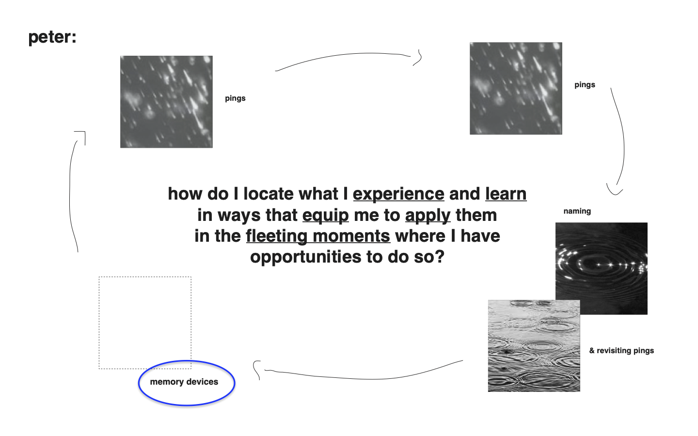<figcaption>
Iteration of Ping Practice method diagram by Laurel Schwulst.
</figcaption></figure>

Ping Practice is meant to help you become clear about what's meaningful to you and make that meaning memorable enough to embody.

Although, as [Alex](https://www.alexhollender.info/), [Jeff](https://jnoh.net/), and [Laurel](https://laurelschwulst.com/) have identified, it's not yet clear to what extent – if any – Ping Practice (the app/tool) offers the affordances people need to be inspired and equipped to compile/create/converge on these meaningful artifacts.

I think it's important to arrive at a clear opinion on the above – regardless of what that opinion is – because I think these artifacts are fundamental to addressing the [core needs](https://ping-practice.gitbook.io/pings/needs) Ping Practice is an effort to meet.&#x20;

This topic feels quite big to me. To start, I'm thinking I'll review the meaningful and memorable Pings I've created over time.

## 31 December 2023

### Notable Pings

<figure><figcaption>
Notable Ping (30 Dec 2023)
</figcaption></figure>

Every so often, [a Ping will emerge that feels distinct from other Pings](#user-content-fn-4)[^4]. I know I'm encountering a Ping of this sort when its emergence causes a flood of other Pings to surface or collect within it. Sometimes, these Pings have the effect of making movement clear in a context that I'd previously felt stuck within.&#x20;

_In my mind is the image of a natural dam giving way and with it, water flowing freely through – what had previously been – a constricted waterway._

Last night, a Ping of this sort surfaced, _"I'm creating from a place. I'm not creating to get to a place."_ This Ping, combined with a series of Pings before it, [summed into me becoming unblocke](#user-content-fn-5)[^5]d and clear and how I might go about nurturing [a creative practice that harmonizes with being present as a new father](https://www.youtube.com/watch?v=JRIosU6X060\&list=PLKUjvP9gOhhhrrTXtjXLMpfmrQ5_6SshL).

Beyond these Pings' power to unblock and generate new thoughts, they tend to be durable, relevant to the broader context/place[^6] I find myself within. In hindsight, these Pings also tend to be memorable. They can quickly bring me back into the moment they served me within...they can demarcate time.

The power and durability of these Pings leads me to wonder:

1. _How – if at all – might the interface inspire you to converge on "notable" Pings?_
2. _Where – if at all – might the interface afford space for "notable" Pings to gather?_

## 27 December 2023

### Revisiting&#x20;

* Revisting: consistently experiencing instinct to "go back"; current ability to explore feels limited&#x20;
* Artifacts: neding affordance(s) to inspire me to create intentions&#x20;
* _Look back through "meta" pings_

## 18 August 2023

### Sharing Pings with another person

Natalia and I talking led to me sharing my screen with her and scrolling back through Airtable, showing what's pinged for me recently.

While doing so, I noticed myself feeling at ease and grateful. Both by the content of the pings I was revisiting and the space this friend has generously opened for me to do so.

I also noticed this act prompted Natalia and I to talk about what we were both seeing. That part felt especially nourishing and inspiring to me.

## 7 July 2023

### Making "🟢 Active" a daily act

I'm coming to find that what I need to be reminded of is dynamic; it varies day-by-day. And yet, I'm still not yet feeling like the "🟢 Active" view inspires me to revisit and reprogram it at a commensurate cadence. &#x20;

The [automated email](loose.md#25-june-2023) is helping some. Seeing the "🟢 Active" email arrive each day has caused the space itself to become more top of mind, but I've yet to find myself going into Airtable and asking myself, _"Which of these are still relevant for today? Which is relevant for today that might not currently be represented?"_ and acting on the answers.&#x20;

With this context in mind, an idea emerged this past weekend (30 June): I set an intention for a defined period of time:

<figure>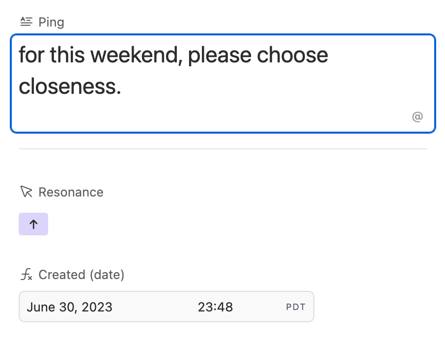<figcaption>
Intention for set for the weekend of 30 June
</figcaption></figure>

This worked for me! I remembered the intention and for the most part, embodied it.

The success of this little experiment brought me back to think about  "🟢 Active" and wondering whether the pings within it ought to be bounded by time in some way. I feel like I'd rather arrive in active and there be nothing there than arrive there and the contents feel stale. I worry that in the latter scenario, the value of the view itself starts to degrade over time. I also wonder how the view might feel more delightful, more inspiring...I want to arrive in "🟢 Active" and feel pulled to touch things, move things, "pick things up," etc.&#x20;

## 25 June 2023

### Automations

<figure><figcaption>
"Each morning, email me a list of the pings I've marked as active"
</figcaption></figure>

Woah, this morning (Sunday) as I was revisiting the pings I've sent over the past week I learned about the "Automation" functionality Airtable offers.

To start, I've set up an automation that will send me an email me each morning with a list of the pings within the "🟢 Active" view. _This view is filled with the pings I've said I'd like to remember / keep top of mind._

I think I was immediately attracted to the potential of [the Automation functionality](https://support.airtable.com/docs/getting-started-with-airtable-automations) because I've noticed myself **not** revisiting the intentions within the  "🟢 Active" view consistently. As a result, when I do revisit the view, I find the pings that are there stale/no longer as resonant or relevant. I wonder if the view itself being more present in my mind might cause me to more actively tend to and use the space for what I originally needed it for: to help me remember the intentions I'm trying to embody.

_Say more_

<figure><figcaption>
Using comments as a draft space
</figcaption></figure>

I continue to love having the ability to "say more" about a ping that speaks to me as I'm going back and revisiting.

Earlier today, I happened upon a ping about a new potential are.na channel and immediately felt compelled to start using Airtable's commenting feature to start drafting a potential description for the yet-to-be created channel. A little bit of movement and progress made possible by the tool I needed in that very moment being close by!

## 6 June  2023

<figure>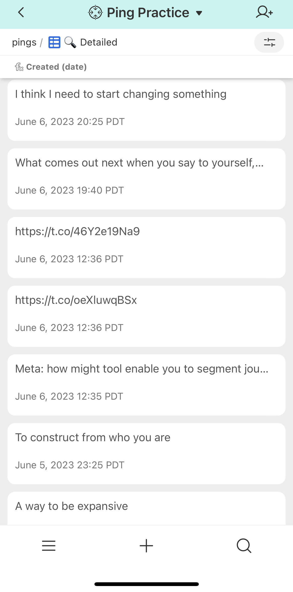<figcaption>
The view I typically land on when opening my Drop Journal.
</figcaption></figure>

When I open Airtable in low-intent moments to browse through past pings, I notice myself gravitating towards shorter entries and quickly bypassing longer ones.&#x20;

I wonder if this pattern could be explained, in part, by how little attention I feel motivated to expend in these in-between moments and how quickly something needs to grab my attention for me to become engaged.&#x20;

## 29 May 2023

_I want to tidy these notes up..._

* instinct to archive "..reliably produce coherent structure" (bit of language I resonated with and have since used)
* adding comment to contextualize a quick ping "urgency instilled"
* amazing how quickly i can remember the moments these thoughts emerged within. reminds me of the bit about forgetting:
  * I have more to say here, but the important thing to me in this moment is the freedom from thinking that it is me who is breaking. It is not me. It is the tools themselves and I need more from them. [source](http://maybeuseful.org/posts/Forgetting/)
* i'd like to see what's resonated with me over time
* i'd like to be able to turn a ping into a timer
  * context: [https://twitter.com/pingpractice/status/1648571314687586304](https://twitter.com/pingpractice/status/1648571314687586304)
* maybe there's an activity feed?
  * [https://twitter.com/pingpractice/status/1650384272770088960](https://twitter.com/pingpractice/status/1650384272770088960)
  * another way to find your way back
  *   something about the idea of "bumping" something to the top (actually, maybe it's a "resonance" view sorted from highest to lowest?)

      \

## 12 May 2023

### Resonance Button + Count

<figure><figcaption>
The new "+" button that appears on each Ping. When clicked, the integer in the "Resonance count" field gets incremented by one.
</figcaption></figure>

Today, I added a button that, when clicked, increments an integer within the newly-added `Resonance count` field by one.&#x20;

I'm thinking this could be an effective way for my present self to say something to the effect of, _"Hey, you seem to be curious about this."_ to my future self. A future self that could be wondering, "_What has been connecting/resonating with you lately?"_

While it feels important to me that interface present information/cues without being too opinionated about what – if any – action you take in response, I can immediately see the answer to the above being helpful for deciding what you might consider sketching a guide/tool for.

Unfortunately, Airtable does not support scripts, and by extension the `✚` button on mobile :/

## 11 May 2023

### `🟢 Active` View and Jigs


Walkthrough of Drop Journal `🟢 Active` view as of 11 May 2023.


Okay! Something is connecting and I'd like to try to map it out...

I notice [the current Airtable set up](loose.md#details) enabling/prompting/affording me the ability to do [what I felt like I've needed all along](needs.md#needs): "present peter" [remembering and crucially, acting on the clarity/truths/intentions/etc. "past peter" converged on](#user-content-fn-7)[^7] _within_ the fleeting moments where I/he[^8] has sensed opportunities to apply them.

Naming the above feels notable. Reason: in coming to realize this impact, I think I'm also starting to see the factors that may be contributing this slight behavior change emerging:

1. I'm revisiting `🟢 Active` often.&#x20;
2. In revisiting, I'm engaging with/"picking up"/thinking/considering what's there. Said another way, when I'm in `🟢 Active` , I'm active! I'm asking myself questions like, _"Is this card still relevant? How might I make this language more memorable? What picture/video might illustrate the essence of this card?"_

Put simply, I think "1." and "2." are causing these cards, and the messages they represent, to remain present in my mind when I'm out in the world, away from this interface.

_Resulting questions_&#x20;

* [ ] _How opinionated/explicit should the interface be about prompting you to remove threads that are no longer meaningful to you from `🟢 Active?` E.g. Would it be useful for there to be some  limit to the number of threads/cards that can be active at any point in time?_
* [ ] _How might the interface encourage you to iterate towards making these cards more memorable and meaningful? E.g. do cards within active have an upward character count?_&#x20;

## 7 May 2023

### IDs + Record linking

<figure><figcaption>
Searching for a record to link to the current one.
</figcaption></figure> <figure><figcaption>
Showing the new ID field visible on the card.
</figcaption></figure>

Ok! Two adjustments tonight that I feel energized about...

1. I added an `ID` field to the Airtable base and exposed it on cards in the `🟢 Active` view. This field will get automatically populated each time a new record is added.
2. I added a field that will enable me to link records together.

When I combine the following three things:

1. The two adjustments above&#x20;
2. The language shift from `📍Pinned` to `🟢 Active`,&#x20;
3. The assumptions that I'll continue regularly revisiting the "`🟢 Active"`view

... I can start to see a future where:

1. I'm able to recall the `IDs` of cards that are important/meaningful to me at any given time **from memory**.\

2. I'm revisiting, referencing, refining, and expanding these cards more often and by extension, they're becoming more meaningful.\

_Note: the two scearios I'm describing above already happens to me at work with_ [_Phabricator_](https://phabricator.wikimedia.org/) \
\
_It usually goes like this..._\
\
_We'll start work on a range of tickets. There will be some subset of these tickets that I/we reference more often than others. As this happens, I start to memorize the numbers of these tickets. And then, because I've memorized these ticket numbers, I end up referencing these tickets in conversation and in my own thinking/writing more often._ \
\
_In doing so, I end up revisiting these tickets to contribute new information (no matter how small) and refine what's already there. I also link to these tickets in the new tickets I create and comments I write elsewhere._&#x20;

[_All of this sums into discrete artifacts that reflect and "hold" what I/the team actually thinks and are linked together creating a legible record of what we did and did not decide/make over time the impact of which is, I think a team that can learn and evolve together and therefore feel more fluid making decisions, experimenting and trying things out._](#user-content-fn-9)[^9]

## 5 May 2023

### Marking a thread as active


Showing workflow for marking a thread as "🟢 Active" in Airtable.


I find myself needing some extra support as I move into creating public doorways into this project (I'm thinking about a conversational video format to start. E.g. TikTok or Instagram Reels).

To provide that support, I'm going to experiment with doing the following:

1. Creating a thread to "host" / "hold" the conversation about this voice I find myself wanting to use
2. Marking this thread as 🟢`Active` so that it's easy for me to revisit.
3. Associating a picture with this thread so that it's more memorable and easier for me to arrive into the mindset it's asking me to.
4. Using Airtable's native Commenting feature to hold any thoughts that may emerge in the future. _Note: this one feels notable in so far as it's the first time I'm branching out from Twitter as the sold mode of composing._

## 3 May 2023

### Prompting / Scripting

<figure>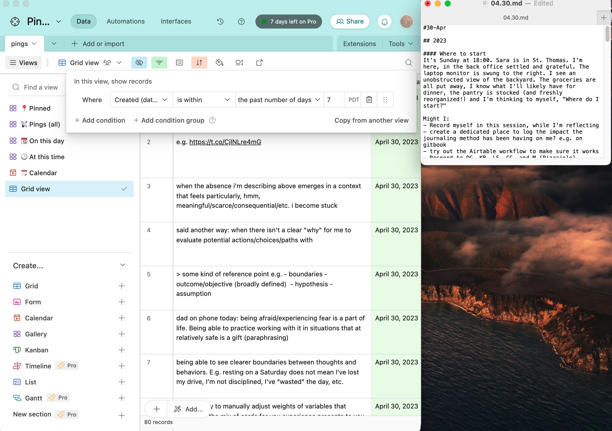<figcaption>
Left: All pings from the past 7 days (Airtable). Right: 04.30.md note within <a href="experiments/dailynotes.md">DailyNotes</a>.
</figcaption></figure>

I jotted down – what felt like – a bunch of thoughts in my Drop Journal this past week. On Sunday (30 April), I sat down at my computer to try to make some sense of them ahead of the week I'm currently in.

To ready myself for this sensemaking, I created a view of what I'd dropped in my journal over the past seven days and brought up the `04.30.md` note within my [DailyNotes](experiments/dailynotes.md) alongside it. Raw material and a surface to sort through it.

In doing the above, I was wanting to revisit the specific things I'd been thinking about. More specifically, I was wanting to arrive back in the headspace those thoughts emerged within. Seeing everything together in a moment where I felt like I had the space and energy to think was wonderful.

Reflecting on the above brought me back to what Obi shared during the [first set of conversations](conversations/phase-2.md). Obi shared that when he arrives in the studio for a recording session, he'll often pull up his Apple Notes to review what he's been thinking about to see if anything there inspires/moves him to make music to.

The connection I'm drawing here between the experience I had on Sunday and the experience Obi shared with me some months ago feels fresh and notable to me. I think it's because I'm starting to see a more visceral connections between these contexts/applications: improvisation and bringing together/readying the "raw material" to do so.

### Improv

The reflection/observation above is leading me to see a potential way through the blockage I've felt posting more publicly...

What if I act like Obi does:&#x20;

1. Book "studio sessions" for myself. As in: I'll commit to making something to share at a specific time and place for some bounded period of time.
2. In the time between each "improve sessions" I'll log all the ideas that surface to me in a consistent place.
3. When I arrive at the "studio" I'll "swipe through" the ideas that I've accrued through "2." and act on one that speaks to me.

## 27 April 2023

### Pinned

<figure><figcaption>
Using the new "📍Pinned" view for the first time.
</figcaption></figure>

I'm starting to use the "Pin" field I set up yesterday which in turn inspired me to add an image today. Cool!

_Aside: I wonder if it might be interesting to call – what I'd previosuly been referring to as "Favorites" – simply "Active"...at least by default. Keep it simple, generic, and uncomplicated by people bringing existing meaning and expectation(s) to the word._

## 26 April 2023

<figure><figcaption></figcaption></figure>

Added a "Pin" field that I'm thinking I can use to mark and quickly return to thoughts I want to more easily revisit.

## 24 April 2023

### Dashboard

<figure><figcaption>
Dashboard showing @pingpractice account activity over time
</figcaption></figure>

Woah!&#x20;

Now that I've got this dashboard set up, I'm immediately curious to see how - if at all – this view provides me a lens through which to look at, and engage with, this Ping Practice.

### Adding meaning to "Favoriting"

<figure><figcaption>
Airtable's "Dashboard" interface builder.
</figcaption></figure>

Discovering that Airtable makes it possible to associate an image with a record (or in this context, a Ping), is helping me to imagine a new potential choice to consider when revisiting: looking out for Pings that feel especially resonant so that I can consider elevating them in some way (e.g. associating an image, or other types of media) to deepen/enhance/extend the meaning/message of the Ping and my ability to remember that meaning/message.

_Note: the above was prompted by me experimenting with setting up a "Dashboard" for the base I set up in Airtable. In doing so, I thought "Oh, it might be interesting to visualize how many Pings I've 'Favorited'."_

_See:_ [_https://twitter.com/pingpractice/status/1650580408151740417_](https://twitter.com/pingpractice/status/1650580408151740417)

## 12 April 2023

### Search

<figure><figcaption></figcaption></figure>

Just now, I was [saying something in @pingpractice](https://twitter.com/pingpractice/status/1646205350817955843?s=20). In the process, I noticed myself making a choice _not_ to use a possessive pronoun.  In making this choice, I thought to myself, "Oh this would be a good convention/pattern to name in the ["Personal syntax" are.na channel](https://www.are.na/peter-pelberg/personal-syntax) I started."

Next, I opened up are.na and I started [drafting this block](https://www.are.na/block/21361463) to describe/bring shape to this convention. A few moments in, I noticed myself getting stuck, not locating the words I felt like I needed to express the idea that prompted me to visit are.na in the first place.

_"Hmm, what to do now?"_ I thought and then realized, _"Oh, I've "pinged" (trying out this language) about this before."_

I then went to Notion to search for `pronoun` which quickly returned what I've said in the past about possessive pronouns and ultimately helped me arrive at the language I needed!

Before Monday, I would've gone directly to Twitter to attempt the search above which  past experiences have led me to doubt whether that search would return the Tweets I'm fairly certain existed.

## 11 April 2023

_Observe during the Ping Practice (0.1) experiment._

#### Day/time lens/filter

.png>).png>)

I finished [this past Monday (10 April) feeling](https://twitter.com/pingpractice/status/1645606642724261888?s=20) similar to how I remember myself [feeling the Monday before (3 April)](https://twitter.com/pingpractice/status/1643057038199787520).

This led me to experience, and subsequently [develop a bit more conviction around](https://twitter.com/pingpractice/status/1645606642724261888), the utility of  [the app](app.md) offering people an easy way to see what they've said on days/time that are similar to the moments they currently find themselves to be in and/or curious about.

In response, I created a new view within Notion that enables me to easily [see what I've said "on this day" across time](#user-content-fn-10)[^10].

## **9 April 2023**

On Saturday, I was making coffee and I wanted to "capture" the sound of the coffee dripping down from the V60 cone into the coffee that had already accumulated in the caraffe atop which the V60 rested.

So, I [took out my phone and started recording](https://www.dropbox.com/s/2ni1our7u5lgebm/Making%20as%20describing.m4a?dl=0). Not too long after, I started talking about something else.

I've noticed this happen a few times: what prompts me to start recording a voice memo ends up not being what I end up spending the majority of the momo talking about.

Right now, I see two bits of information in the pattern above:

1. I feel comfortable talking \[aloud] with myself. It feels natural to me. Once I get going, I do not seem to have difficulty knowing "where to go" next and/or how to go about getting there and ultimately "landing" the note.
2. It's important that [the app](app.md) make capturing a voice memo as easy as snapping a photo. This way, people feel inclined to act on those little instincts to capture something which could lead to some larger expression.

## **20 February 2023**

### **Medium and speed**

Tonight, [something new felt like it "clicked" in my mind](https://twitter.com/pingpractice/status/1627869317965684736) related to how I've been experimenting with [authoring journaling prompts](https://www.are.na/peter-pelberg/journaling-prompts-oyhfj1bz7c4).

It was the kind of moment where I felt like I was brought back to an activity \[i] that I thought I had figured out the meaning and inner-workings of.&#x20;

Although upon revisiting this activity, I noticed something new that led me to think something like, _"Hold on...not so fast. I don't have this figured out. I think there's a lot more here than I initially thought."_&#x20;

To capture this new facet, I immediately [reached for Twitter to jot it down](https://twitter.com/pingpractice/status/1627869317965684736) so that I could let the thought go and return to cooking dinner.&#x20;

Later, when I returned to my laptop to flesh out this facet, again, I reached for writing. Then, noticing the time (21:40), I thought, _"It's getting late and I've got other things I want to do, why don't I just record a voice memo and come back to this another time."_

I [did just that](https://www.dropbox.com/s/0u2hnlknkwwvjn7/Prompting%20myself.m4a?dl=0) and yet, I didn't feel the sense of satisfaction and clarity that writing has delivered in the past and that I was seeking in this moment.&#x20;

_"Is it the medium?"_ I asked myself.&#x20;

Although, having arrived here and explore this question a bit I'm coming to wonder whether the differentiator in this moment was time...the amount of time I invested thinking about the facet I was motivated to explore. That voice memo is 2 minutes and 59 seconds long. That's not a lot of time to think, regardless of the medium I'm using to think with and through.

\--- \
i. In this case, drafting a prompt in my mind in response to something I was feeling)&#x20;

### Conditions for contribution

Some loose/quick/initial thoughts on space...

* I resonate with spaces where I, and the people who are present with me in it, feel safe and empowered to improvise&#x20;
  * Where "improvise" in this context means the ability to notice new information, without judgement, and make choices that they think cohere with what the people who share in the space are present to create.&#x20;
* I feel empowered to participate in a space when ([source](https://twitter.com/pingpractice/status/1577778444296929280?s=20\&t=66lYHsjFlZDKZxR8LT_f_g)):
  * There is a clear and shared objective for what we are trying to make (defined in the broadest of terms)
  * I trust that others will check whether they’ve understood what I’ve said in the way I intended it
  * I trust that I will have an opportunity to repair harm if/when I cause it
  * I trust that I will be seen for what I know and have experienced
  * I trust I will be listened to
  * I trust that others will assume I am acting in good faith
  * I know that we have practices/traditions in places to remember the choices we make and why
* I enjoy playing the role of someone who:
  * Creating the conditions necessary for the group to decide what they will commit to making and why&#x20;
  * Supplies the group with the clarity they need to deploy the expertise they've developed.&#x20;
    * Where "deploy" could mean things like: assessing risk, creating an artifact, determining whether a piece of new information is notable enough to be shared with the rest of the group

## **9 February 2023**

I miss the ability to edit/iterate upon what I've said. \
\
Example: tonight I sketched [Creating Space](https://www.dropbox.com/s/mlnqccqstomynf6/Creating%20Space.m4a?dl=0). \
\
Upon finishing, I thought, _"Hold on, I don't feel like 'creating space' quite captures what I'm trying to express here. I think what I'm trying to expresss is closer to, 'I am drawn to co-creating space with other people in service of making an impact together.'"_\
\
I suppose I could've recorded another sketch, but for a reason I have not yet named, I didn't.&#x20;

And so to me, that obviously "imprecise" thought lies hanging.&#x20;

Although, now that I've gotten here, I'm thinking to myself, _"Well, why not try recording a follow-up sketch. Alternatively, if/when there becomes a point when you do this kind of sketching publicly, perhaps that gap between what you meant to communicate and what you did communicate could be the invitation someone else needs to feel motivated, welcomed, and safe to participate in the conversation?"_

## 3 February 2023

### Prompts&#x20;

I value it when a space, person, etc. invites me to say aloud something for the first time.

This happened during [today's are.na walkthrough](https://www.are.na/are-na-team/02-03-23-channel-walkthroughs-ft-luiza-dale-peter-pelberg-noa-mori-njari-anderson): _I appreciate prompts that are proximate and clear enough that I can immediately pick them up/reach for them and in doing so, be moved to see something that feels new, fresh...something I might not have seen otherwise._

## **2 February 2023**

I've tried using voice memos to express how I'm feeling twice now (ordinarily, I'd reach for writing in these moments).

I have not yet felt satisfied with voice for expressing this kind of feeling/thought. In part (I think) because voice feels too fast for me.

The medium moves at the speed of my voice which is helpful for "getting something down" before it escapes me. Tho, often too fast for me to process how I'm feeling.

I'm not able to write (or more accurately, type) as quickly as I can think. In this context, I find it helpful to be slowed down...to fix typos...to take a moment to re-read the sentence I just wrote before proceeding on...to sigh.

## 8 January 2023

### Reminders&#x20;

When I start the process of thinking about something I need to do (e.g. a conversation I need to lead, a decision I need to make, a set of slides I need to produce, etc.) that is not yet clearly "scoped" in my mind, I'll usually create a new section in my "scratch" file.

I'll title that section the name of the thing I'm needing to do and within it, add a few, standard sub-sections. \[i]

Lately, when thinking about doing something that I'm less practiced with, I've started adding a new section titled, "Reminders."

Within this section, I'll place things, that well, I find myself needing to be reminded of in order to "embody" the space the thinking I need to do exists within.

For example, in the moments before writing this, I was sketching out what it might look like to send an email at some  cadence that serves as _invitation_ for people _into_ the work I'm doing to refine and actualize [the app](app.md).&#x20;

Doing the above feels new for me and I found the reminders (see screenshot below) effective for inspiring me to "keep going" in moments when uncertainty tempts me to stop.

 (1) (2).png>)

\---

i. The "standard sub-sections" I add are:

* Objective
  * _"What impact is/are the actions I am trying to define an effort to accomplish? For who?"_
* Decision(s) to be made
  * If the outcome of this thinking is me making a decision: "_How can I articulate the decision(s) in a way that makes it clear what this decision will, and crucially, will NOT impact?"_
* Open Questions
  * _"What questions are emerge as I inhabit the space of this challenge/objective/etc.?_

## 3 January 2023

### Journaling and Self-Knowledge

The path here started with journaling. Overwhelmed with thought, I turned to writing to "move through" what I was feeling. With time, journaling equipped me with new capacity and tools to "hold" more and "let go" more easily. It also summed into a body of self-knowledge I've drawn on to make choices of all kinds that continue to shape the experiences and impact I \[attempt to] have here.

It feels good to say these words – "journaling" and "self-knowledge" – aloud again; they feel true, solid, capable of being build upon.&#x20;

I've felt far away from this language and I'm grateful for Ashley, Kyle, and Obi for bringing me back to it. I feel at home in them and I'm eager to invite more people in using them.

## 27 November 2022

### Questions

I like how conceiving of questions/prompts as doorways draws my attention to the responsibility that questions/prompts have for earning the trust of the person receiving them and evaluating the extent to which they'll engage with them.

This leads me to a question that's something like: _"What could cause people to feel more trusting of, and willing to engage with, a question that doesn't immediately resonate with them?"_&#x20;

That phrasing doesn't quite capture it, but it's a start.

## 19 November 2022

### Micro-syntax

I'm attracted to describing the personal classifiers I talked about on [3 November 2022](loose.md#3-november-2022-1) and [31 October 2022 ](loose.md#undefined)as a kind of "micro-syntax" or way of declaring or codifying types of thought in an explicit enough way that I "operate" on them at some later point.

### Quotations

Speaking of micro-syntax, I've developed a habit of using quotation marks (`" "` ) as a way of communicating to myself, and ideally other people, that a particular word or metaphor I'm using is a sketch, not yet something I have conviction in.

I find that doing the above helps break me out of the _"find the ideal"_ language loop I can find myself getting stuck in when trying to externalize a nascent thought.

## 3 November 2022

### Reflex

Building on the idea of [thought types from 31 October 2022](loose.md#undefined), I wonder if there could be meaning in experimenting with using a`[reflex`] thought type.&#x20;

Where "reflex" could be a moment when I feel, say, unseen, hurt, sad, etc.

The idea here being these reflexes are likely related by a perceived unmet need, value, etc.

_Aside: I feel inclined to create a page titled something like "Thoughts." I'm imagining I'd use this page initially for: A) defining "thought types" and B) defining what I mean when I say "thought" considering how central that concept is to this practice._

## 31 October 2022

### Thought types

I have gotten into a habit of prefixing some things I say to myself (and other people in certain contexts) with a term bounded by square brackets. So, things like:`[question]`, `[prompt]`, `[idea]`, `[ask]` etc.

And I'd like to draw a quick sketch for why I think this might be the case:

1. **Stability/Durability.** Questions, prompts, ideas, etc. are relatively stable and distinct concepts/categories of thoughts in my mind. Experience has demonstrated to me that my current and future selves are likely to have a shared understanding for what does and does not qualify as a question, prompt, idea, etc. \
   \
   In this way, using a tag as stable as \[`question]` makes it possible for me to easily assemble a set of related thoughts across time. This helps make answering big, and generative, questions like _"What have I been wondering about over the past few weeks?"_ or _"What might I write about it? Why don't I see what `[writing ideas]` I've thought about in the past couple of weeks"_ pretty easy to ask and answer.
2. **Applicability.** Questions, prompts, and ideas, have clear use cases in my life. In this way, being able to more easily locate them across the various tools where I accrue them creates a great deal of possibility for me.
3. **Legibility.**  Just like the presence of a question mark (`?`) makes it clear to people what a thought is seeking, prefixing a thought with bracketed thought type - I think – makes it easier for people to understand what it is a particular thought is trying to say to them.

For context, I felt compelled to write all of this after noticing myself using the `[prompt]` construct in a new context: within a "Book Note" for _Thought As A System_. \
\
I think I considered this notable because seeing myself using this pattern in a new context without thinking about led me to think something like, "Huh, this pattern seems become useful enough to be something I'm "bringing with me" wherever I "go."

_Aside: I'm reluctant to categorize the above as "tags" per se, but I think that's just because I have negative associations with a particular implementation of tags which I appreciate to be a far more open-ended concept. Maybe it would be worthwhile to talk about tags some more  and why I think the implementations I've seen have done little to guide me to use them in ways that make it easier for my future selves to find what they are looking for later. Think: topical and the moments tools often present people with the opportunities to apply them._

## 28 October 2022

### Directing pings

I think it would be neat if the tool could support me sending pings (_see below)_ to the tools I'd like to act on them within.&#x20;

The above leads me to wonder whether there's something to this idea of being able to create some kind of "meta" area around the workspaces I frequent.&#x20;

_Thinking: these activity spaces would become more generative and richer, and the ideas within them would become stronger, if I could more easily draw on relevant thoughts/ideas while I'm working within them. I also wonder whether having the ability to "send" pings to these spaces without having to visit them would help me advance ideas more quickly because I will have better recall of the range of tools available to me at any given time._

### Fun

Wow. This place feels great to be in...I'm having fun ^ \_ ^ Thank you for the metaphor, Laurel!

## 26 October 2022

### "Stream" Purpose

I think I'm going to constrain this stream to thoughts related to thoughts related to working with information.&#x20;

The above had been pretty much implicit in my mind, but sometimes I find it helpful to explicitly say or write out things out to reinforce them.

## 24 October 2022

### "Where should I put this?"

In the moment just before arriving here, I was feeling excited as I thought about all of the things I wanted to talked about from today.

Now, I'm here. I'm not writing in DailyNotes, I'm not writing in Twitter, I'm not in Messages, and I'm not drafting an email. I could see each of the topics I was wanting to write about being a fit for these different places, but I couldn't see a single place where they'd all fit.

That little question – _"Where should I put this?"_ – was enough to interrupt the flow I felt. I think that's all what I'm wanting to name for now: the blocking force of this choice and the ease with which it can resurface.

### Synthesizing&#x20;

I think writing out loose thoughts has helped me to become more effective at spontaneously synthesizing what I'm thinking in feeling in conversations, meetings, etc.

In this way, I think I'm starting to feel more confident in my ability to improvise.

## 10 October 2022

### Ping Practice Flow&#x20;

Sketches of what information I imagine Ping Practice to hold and how it will flow within the site.\
&#x20;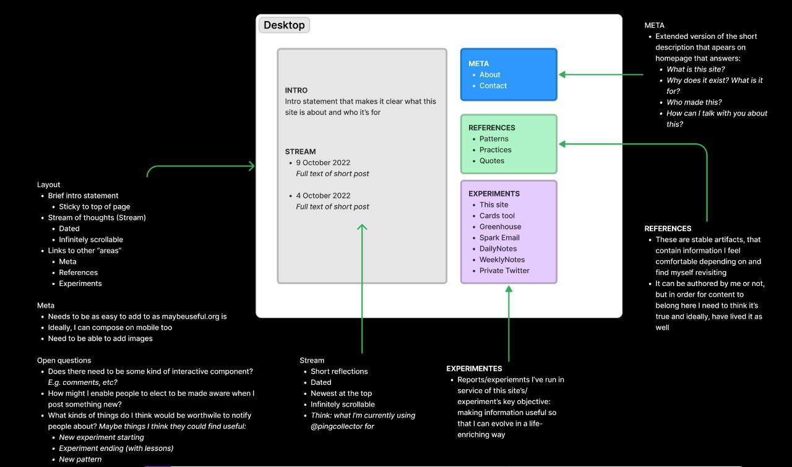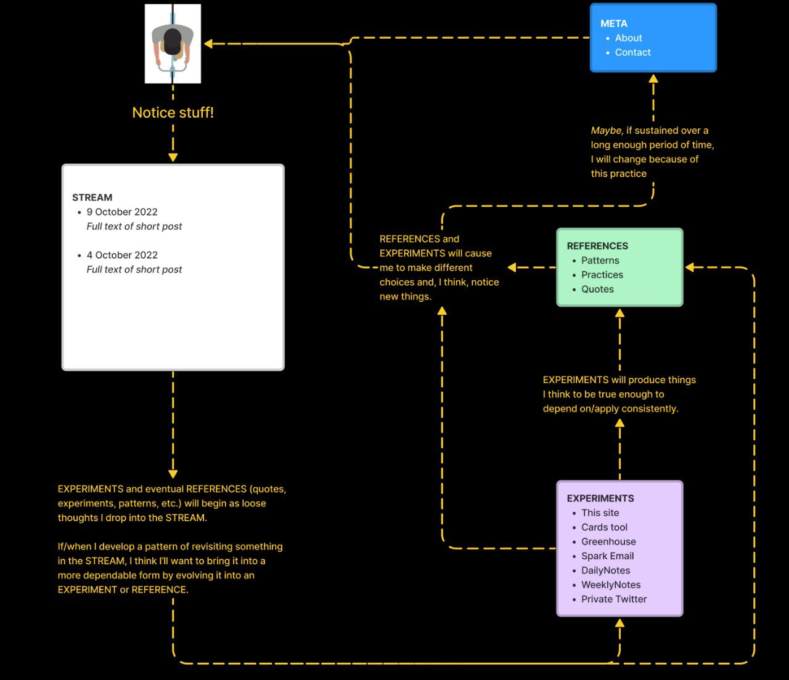

[^1]: Drawing inspiration from Jürgen Schmidhuber writing in [Driven by Compression Progress](https://www.are.na/block/12518234).

[^2]: "The power of meaning is that it completely organizes being." | [David Bohm](https://www.are.na/block/22989196)

[^3]: I think [character creation experiences](https://en.wikipedia.org/wiki/Character_creation) in role-playing video games could be inspiring/instructive here.

[^4]: E.g. ["Pick up the phone"](https://www.youtube.com/watch?v=avOU29QkuPk\&t=33s)

[^5]: [Creating from a place (YouTube)](https://www.youtube.com/watch?v=FlRLZzxCKZw)

[^6]: Where "context/place" here refers to something that spans time on the order of weeks.

[^7]: "Allow blockers to reveal themselves through action." is the card I'm referring to here.

[^8]: this third person stuff gets complicated quickly!

[^9]: this feels important.

[^10]: Ideally, the app will automatically know what day it is and surface relevant thoughts accordingly. Although, with this current set up in Notion, I'm still needing to manually input what day(s) of the week I'd like to see thoughts from.
