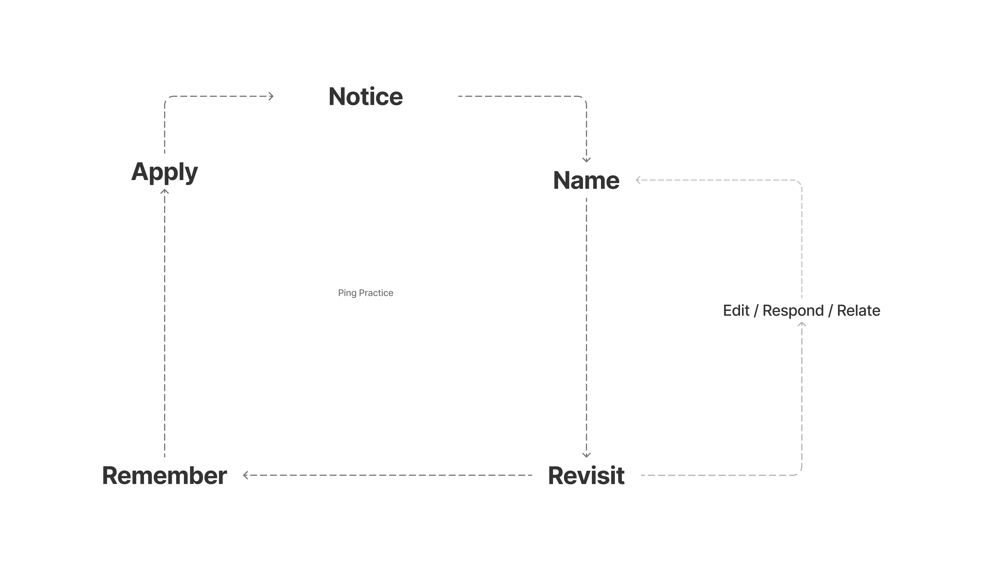

# Method

Ping Practice is a method I'm developing for translating everyday experiences into insights and actions that align with what you need and value.

Insights that can take the form of things like:

<table data-view="cards"><thead><tr><th></th><th></th><th></th></tr></thead><tbody><tr><td><strong>Affirmation</strong> that empowers you to take a next step</td><td></td><td></td></tr><tr><td><strong>Question</strong> that creates clarity</td><td></td><td>

</td></tr><tr><td><strong>Need</strong> that motivates you to speak up</td><td></td><td></td></tr><tr><td><strong>Name</strong> that helps connect disparate experiences</td><td></td><td></td></tr><tr><td><strong>Value</strong> that informs a decision you need to make</td><td></td><td></td></tr><tr><td><strong>Reminder</strong> that helps you stay on track</td><td></td><td></td></tr><tr><td><strong>Awareness</strong> that enables you to detect what is happening and could happen next</td><td></td><td></td></tr></tbody></table>

## Method

### Components

Ping Practice is made up of two core components:

1. A type of thought called a "[Ping](method.md#ping)"
2. A [process](method.md#process) for uncovering the meaning within these "Pings"

### Ping

Ping Practice assumes that within the tiny, everyday, and easy-to-dismiss moments of resonance are clues to new meaning and insight. I call these "Pings."

A ping can take on any form: word, phrase, title, rhyme, name, lyric, quote, place, color, texture, melody, idea, feeling, etc.

The most important thing about Pings – and what differentiates them from other thoughts – is that a Ping is something that moves you, "clicks," or otherwise resonates in your body.

You are likely encountering a Ping if the movement or attraction you sense seems intuitive, automatic, and reflexive...as if what you are encountering relates to something that's been latent within you.&#x20;

In this way, there are many ways to detect a Ping. For me, I know I'm encountering a Ping when I feel something in my body (e.g. maybe I notice the hair on my arm standing up).

<figure><figcaption>
Ping Practice
</figcaption></figure>

### Process

Ping Practice is a loop with 6 steps within it.

1. The first step is **Notice**. \
   \
   This means being aware and present so that you can notice things that "Ping" something within you.
2. The second step follows quickly after the first: **Naming**. Giving some language – no matter how rough – to what Pinged for you and locating this ping in the place where you've put all of the other pings you've logged before.\
   \
   _The most important thing in this moment is making sure the name you give to the Ping is clear and descriptive enough for your future self to recall what you were referring to._
3. The third steps is to **Revisit** previous Pings. \
   \
   The cadence with which you revisit can vary. _The most important thing is that you revisit regularly enough that you start to develop an ambient and intuitive sense for the what's been speaking to you._&#x20;
4. The fourth step happens as you Revisit: **Elaborate.** \
   \
   For a Ping to acquire meaning, you need to:
   * _Edit_ Pings so the language you use to represent them better reflects what it was that you initially Noticed.
   * _Re_s_pond_ to Pings as a way of exploring all that a particular Ping could contain/bring up for you.
   * _Relate_ Pings to one another to help identify and name patterns that could help to explain your resonance with a particular Ping or set of Pings.
5. The purpose of Ping Practice is to turn the little things you notice (Pings) into insights that you can apply/act on. A core part of the "applying" part is making sure Pings are easy for you to **Remember** in the small windows you have opportunities to apply them. \
   \
   This means two things:
   1. Making Pings that are important to you memorable so that you can quickly recall them _and_
   2. Organizing these Pings in places where you will you be able to easily "reach" for them when you have opportunities to act on them
6. The last step before the Ping Practice cycle repeat itself is **Applying**. \
   \
   Taking the insights you have converged on and acting on them. Doing so will cause you to **Notice** new things which starts the cycle all over again.

## Impact

Ping Practice has impacted me in a range of ways.&#x20;

* **Improved memory and recall**&#x20;
* **Greater awareness of reflexive thoughts**&#x20;
* **Better ear for my internal monologue**
* **More self-acceptance**&#x20;
* **Generating more ideas**&#x20;

