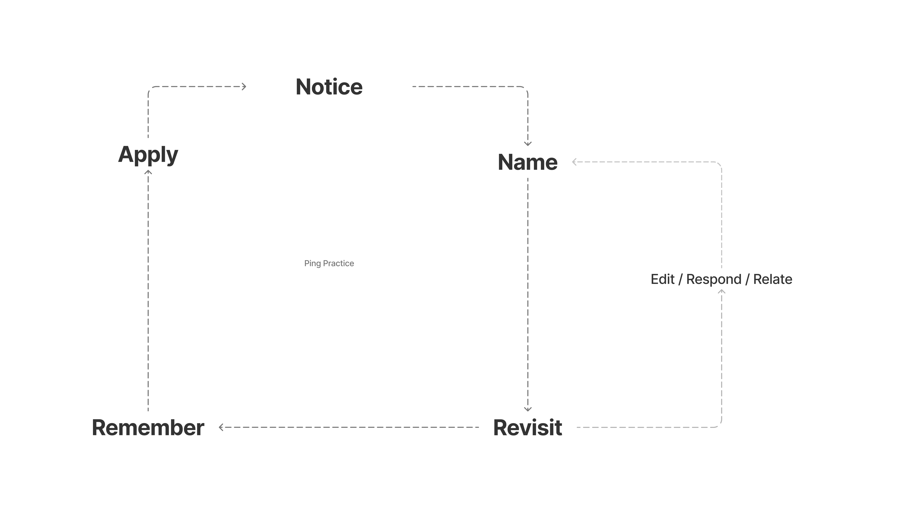

# Ping Practice

Ping Practice is a method I've converged on for turning what I notice into meaning I can apply.

Where "meaning" could take the form of things like...

<table data-view="cards"><thead><tr><th></th><th></th><th></th></tr></thead><tbody><tr><td><strong>Pattern</strong> that helps scattered thoughts snap into place</td><td></td><td></td></tr><tr><td><strong>Solution</strong> to a challenge you're sitting with</td><td></td><td></td></tr><tr><td><strong>Need</strong> that might explain a pattern of behavior</td><td></td><td>

</td></tr><tr><td><strong>Affirmation</strong> that empowers you</td><td></td><td></td></tr><tr><td><strong>Question</strong> that helps you focus</td><td></td><td></td></tr><tr><td><strong>Idea</strong> that you want to make</td><td></td><td></td></tr><tr><td><strong>Reframe</strong> to get unstuck</td><td></td><td></td></tr><tr><td><strong>Value</strong> that is important to you</td><td></td><td></td></tr><tr><td><strong>New</strong> choice to consider</td><td></td><td></td></tr><tr><td><strong>Reminder</strong> that helps you stay on track</td><td></td><td></td></tr><tr><td><strong>Title</strong> for a project you’re working on</td><td></td><td></td></tr></tbody></table>

## Method

<figure><figcaption>
Ping Practice
</figcaption></figure>

### Components

Ping Practice is made up of two core components:

1. A type of thought called a "Ping"
2. A method for uncovering the meaning within these "Pings"

### Ping

Ping Practice assumes that within the tiny, everyday, and easy-to-dismiss moments of resonance are clues to new meaning and insight. I call these "Pings."

A ping can take on any form: word, phrase, title, rhyme, name, lyric, quote, place, color, texture, melody, idea, feeling, etc.

The most important thing about Pings – and what differentiates them from other thoughts – is that a Ping is something that moves you or "clicks" in some visceral way.&#x20;

You are likely encountering a Ping if the movement or attraction you sense seems intuitive, automatic, and reflexive...as if what you are encountering relates to something within you.

In this way, there are many ways to detect a Ping. For me, I know I'm encountering a Ping when I notice the hair on my arm standing up.

### Method

Ping Practice is a loop with 6 steps within it.

1. The first step is **Notice**. This means **** remaining aware and present to notice things that "Ping" something within.
2. The second step follows quickly after the first: **Naming**. Giving some  language – no matter how rough – to what Pinged for you. _The most important thing in this moment is making sure the name you give to the Ping is clear and descriptive enough for your future self to recall what you were referring to._
3. The third steps is to **Revisit** previous Pings. The cadence with which you revisit previous can vary. _The most important thing is that you revisit regularly._
4. The fourth step happens as you Revisit: **Engaging.** For a Ping to acquire meaning, you need to:
   * _Edit_ Pings so the language you use to represent them better reflects what it was that you initially Noticed.
   * _Re_s_pond_ to Pings as a way of exploring all that a particular Ping could contain / bring up for you.
   * _Relate_ Pings to one another to help identify and name patterns that could help to explain your resonance with a particular set of Pings.
5. The purpose of Ping Practice is to turn the little things you notice (Pings) into insights that you can apply. A core part of the "applying" part is making sure Pings are easy for you to **Remember** in the small windows you have opportunities to apply them. This means placing the Pings that are important to you in a place – literally and metaphorically – where you  can recall them when you need to.
6. The last step before the Ping Practice cycle repeat itself is **Applying**. Taking the insights you have converged on and acting on them. Doing so will cause you to **Notice** new things which starts the cycle all over again.

## Impact

_#TODO: why is Ping Practice important to me? Why might other people find it useful.valuable?_

* **Improved memory and recall**
  * I think this has enabled me to become better at improvising. Where "improvise" in this context means having a clear range of ideas, examples, risks, questions, prompts, metaphors, etc. that I could enter in response to a question or prompt in a synchronous interaction.
* **Greater awareness of reflexive thoughts**
  * When this awareness combines with an improved memory, I have come to feel equipped with a broader set of options and solutions to choose from when I encounter a blocker or challenge.
* **Clearer thinking**
* **More self-acceptance / Less attachment**&#x20;
  * _Something about there sensing a clearer boundary between the self-concept I hold and what I think/feel._

## Origin

_#TODO: where does Ping Practice come from? What is a reaction to? What is it trying to achieve?_

